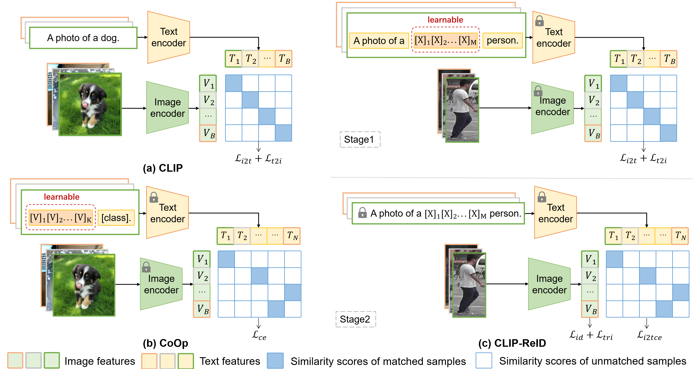

## CLIP-ReID: Exploiting Vision-Language Model for Image Re-Identification without Concrete Text Labels [[pdf]](https://arxiv.org/pdf/2211.13977.pdf)
 [](https://paperswithcode.com/sota/person-re-identification-on-msmt17?p=clip-reid-exploiting-vision-language-model)

### Pipeline



### Installation

```
conda create -n clipreid python=3.8
conda activate clipreid
conda install pytorch==1.8.0 torchvision==0.9.0 torchaudio==0.8.0 cudatoolkit=10.2 -c pytorch
pip install yacs
pip install timm
pip install scikit-image
pip install tqdm
pip install ftfy
pip install regex
```

### Prepare Dataset

Download the datasets ([Market-1501](https://drive.google.com/file/d/0B8-rUzbwVRk0c054eEozWG9COHM/view), [MSMT17](https://arxiv.org/abs/1711.08565), [DukeMTMC-reID](https://arxiv.org/abs/1609.01775), [Occluded-Duke](https://github.com/lightas/Occluded-DukeMTMC-Dataset), [VehicleID](https://www.pkuml.org/resources/pku-vehicleid.html), [VeRi-776](https://github.com/JDAI-CV/VeRidataset)), and then unzip them to `your_dataset_dir`.

### Training

### EmotionCLIP-ReID for FER

This repo also includes a parallel FER pipeline that leaves the original ReID entrypoints intact.

Create the recommended CUDA environment for real training:

```
conda env create -f environment_emotionclip_cuda.yml
conda activate emotionclip
```

Prepare a JSONL manifest with one record per image:

```
{"image_path":"train/000001.jpg","emotion":"happiness","emotion_id":3,"split":"train","au_labels":{"AU6":1,"AU12":1},"au_text":["raises the cheeks","pulls the lip corners upward"]}
```

Generate offline face-landmark artifacts before anatomy-conditioned training. The runtime dataloader reads the
detector-agnostic JSON files, so MediaPipe is not imported by the model:

```
python tools/build_face_landmark_artifacts.py --manifest data/RAF-DB/manifest.jsonl --output-manifest data/RAF-DB/manifest_anatomy.jsonl --artifact-root data/RAF-DB/anatomy --model-path path/to/face_landmarker.task --root-dir path/to/RAF-DB
python tools/audit_anatomy_geometry.py --manifest data/RAF-DB/manifest_anatomy.jsonl --split train --output data/RAF-DB/anatomy_audit_train.json
```

Artifacts generated before schema v2 must be regenerated with `--overwrite`. Schema v2 records detector/model
provenance and repeated-detection jitter propagated into the same units as each geometry feature; the audit will not
substitute coordinate uncertainty when feature-level jitter is unavailable.

Each updated manifest record contains `landmark_path`. An artifact stores normalized `(x,y,z)`, explicit
`visibility`, `confidence`, `uncertainty`, and `valid` for every point, plus pose, crop quality, detector metadata,
and jitter diagnostics. Missing points remain invalid and are never filled with synthetic coordinates. Horizontal
flip and center-crop are applied consistently to image, landmarks, left/right geometry semantics, and feature
uncertainty by `FaceSafeTransform`.

The main ablations are selected without code changes: `MODEL.ROUTING.MODE` accepts `topk`, `free`, `anatomy`, or
`hybrid`; `MODEL.GEOMETRY.ENABLED` isolates S3 versus S4; and
`MODEL.UNCERTAINTY.USE_ANATOMY_QUALITY` isolates the region-quality reliability input. Stage-1 prompt modes are
`legacy` (P0), `role_only`, `median`, `median_mad`, `quality`, `random`, and `shuffled`. Class median/MAD statistics are fitted only
from a deterministic, non-augmented view of the train split and saved with the run.

Stage-2 matrix (each row lists CLI overrides after the config path):

```
S0  MODEL.ROUTING.MODE topk    MODEL.GEOMETRY.ENABLED false MODEL.UNCERTAINTY.USE_ANATOMY_QUALITY false SOLVER.STAGE2.LAMBDA_ROUTING 0
S1  MODEL.ROUTING.MODE free    MODEL.GEOMETRY.ENABLED false MODEL.UNCERTAINTY.USE_ANATOMY_QUALITY false SOLVER.STAGE2.LAMBDA_ROUTING 0
S2  MODEL.ROUTING.MODE anatomy MODEL.GEOMETRY.ENABLED false MODEL.UNCERTAINTY.USE_ANATOMY_QUALITY false SOLVER.STAGE2.LAMBDA_ROUTING 0
S3  MODEL.ROUTING.MODE hybrid  MODEL.GEOMETRY.ENABLED false MODEL.UNCERTAINTY.USE_ANATOMY_QUALITY false SOLVER.STAGE2.LAMBDA_ROUTING 0.05
S4  MODEL.ROUTING.MODE hybrid  MODEL.GEOMETRY.ENABLED true  MODEL.UNCERTAINTY.USE_ANATOMY_QUALITY false SOLVER.STAGE2.LAMBDA_ROUTING 0.05
S5  MODEL.ROUTING.MODE hybrid  MODEL.GEOMETRY.ENABLED true  MODEL.UNCERTAINTY.USE_ANATOMY_QUALITY true SOLVER.STAGE2.LAMBDA_ROUTING 0.05
SF  MODEL.ROUTING.MODE free    MODEL.GEOMETRY.ENABLED true  MODEL.GEOMETRY.FUSION_MODE cross_attention MODEL.UNCERTAINTY.USE_ANATOMY_QUALITY false SOLVER.STAGE2.LAMBDA_ROUTING 0
```

S6 uses the S5 checkpoint and analyzes `class_ambiguity`, `region_disagreement` (only where
`region_disagreement_valid` is true), and `extrinsic_unreliability`; disagreement is never an optimization target.
Sealed-test `test_metrics.json` includes per-image `analysis_outputs` for joining FERPlus annotator entropy or
corruption metadata by `image_path` (`TEST.SAVE_ANALYSIS_OUTPUTS` can disable this payload).

Checkpoints include a versioned experiment signature. Inference rejects Stage-1-only checkpoints, incompatible
class/config signatures, or incomplete anatomy fusion weights; non-strict migrations regenerate prompt token buffers
from the current prompt template instead of silently restoring derived buffers from an older template.
Reliability supervision updates the reliability head without back-propagating into the visual encoder by default;
synthetic occlusion also invalidates covered landmark and geometry evidence before clean-corrupted ranking.

AU fields are parsed and preserved as metadata in this implementation pass; they are not used for AU detection or fusion yet. The canonical emotion order is:

```
anger, disgust, fear, happiness, sadness, surprise, neutral
```

Convert supported datasets into the manifest shape:

```
python tools/convert_affwild2_to_emotion_jsonl.py --annotations-dir path/to/train_annotations --frames-root path/to/frames --split train --output data/affwild2_train.jsonl
python tools/convert_raf_au_to_emotion_jsonl.py --csv path/to/raf_au.csv --output data/raf_au.jsonl
```

If Aff-Wild2, RAF-AU, or RAF-CE access is blocked, use FER2013 as a no-permission baseline. Its label order matches this repo's canonical 7-emotion order:

```
python tools/download_hf_emotion_dataset.py --output-root data/hf_fer2013 --max-samples-per-split -1
python train_emotionclip.py --config_file configs/emotion/vit_b16_emotionclip_hf_fer2013_quick.yml
```

The FER2013 mapping is fixed to the challenge protocol: `Training -> train`, `PublicTest -> val`, and
`PrivateTest -> test`. The test split is not evaluated during training. After the configuration and checkpoint
selection rule are locked, run the sealed test explicitly:

```
python train_emotionclip.py --config_file configs/emotion/vit_b16_emotionclip_hf_fer2013_quick.yml TEST.EVALUATE_AFTER_TRAIN true
```

For JupyterHub, open:

```
notebooks/emotionclip_reid_jupyterhub_fer2013.ipynb
```

If you already have the classic FER2013 CSV, convert it locally:

```
python tools/convert_fer2013_to_emotion_jsonl.py --csv path/to/fer2013.csv --images-root data/fer2013/images --output data/fer2013/manifest.jsonl
python train_emotionclip.py --config_file configs/emotion/vit_b16_emotionclip_fer2013_quick.yml
```

For FER2013 class-folder layouts such as `train/angry/*.jpg` and `test/happy/*.jpg`, convert without extracting pixels:

```
python tools/convert_fer2013_to_emotion_jsonl.py --image-dir path/to/fer2013 --output data/fer2013/manifest.jsonl
python train_emotionclip.py --config_file configs/emotion/vit_b16_emotionclip_fer2013_quick.yml DATASETS.ROOT_DIR path/to/fer2013
```

For RAF-DB, use the development protocol while choosing hyperparameters. It creates a deterministic,
class-stratified validation subset from official train and keeps all 3,068 official-test images sealed:

```
python tools/convert_rafdb_to_emotion_jsonl.py --raf-root path/to/RAF-DB --output data/RAF-DB/manifest.jsonl --val-ratio 0.2 --split-seed 1234
python train_emotionclip.py --config_file configs/emotion/vit_b16_emotionclip_rafdb_quick.yml
```

For the final SOTA-comparison run, first lock the epoch count and all hyperparameters found above. Then rebuild
the manifest with the full 12,271-image official train split, train for that fixed schedule, and evaluate official
test exactly once:

```
python tools/convert_rafdb_to_emotion_jsonl.py --raf-root path/to/RAF-DB --output data/RAF-DB/manifest_official.jsonl --val-ratio 0 --split-seed 1234
python train_emotionclip.py --config_file configs/emotion/vit_b16_emotionclip_rafdb_quick.yml DATASETS.MANIFEST data/RAF-DB/manifest_official.jsonl DATASETS.REQUIRE_VAL false TEST.EVALUATE_AFTER_TRAIN true
```

This two-phase protocol follows recent FER practice that reserves part of RAF-DB official train for development
while preserving the official test split, and still permits final training-sample parity with papers trained on
the full official train set. See [Dual-EmoNet (2026)](https://ietresearch.onlinelibrary.wiley.com/doi/10.1049/ipr2.70301)
and the official RAF-DB benchmark sizes reported in [DUAL (2025)](https://onlinelibrary.wiley.com/doi/10.1155/int/7401168).

Train and run inference:

```
python train_emotionclip.py --config_file configs/emotion/vit_b16_emotionclip.yml --run-id experiment-seed1234 DATASETS.MANIFEST data/emotion_manifest.jsonl DATASETS.ROOT_DIR path/to/images OUTPUT_DIR outputs/emotionclip
python infer_emotionclip.py --config_file configs/emotion/vit_b16_emotionclip.yml --weight outputs/emotionclip/experiment-seed1234/best_emotionclip.pth --image path/to/image.jpg
```

Every training command creates one immutable directory at `OUTPUT_DIR/<run_id>/`; reusing a `run_id` fails
instead of overwriting artifacts. Each run records `resolved_config.yml` and `provenance.json` containing the
Git SHA, dirty/diff hashes, manifest and per-split hashes, dependency versions, seed, and hardware. Notebooks
must resolve artifacts using `utils.run_artifacts.artifact_dir(OUTPUT_ROOT, RUN_ID)` and must not guess the
latest run or fall back to shared output files.

Checkpoint selection uses only `val`. The current pipeline does not fit a temperature or decision threshold.
Any future calibration must use an explicit `calibration` split or a predeclared nested-validation protocol,
never `test`; the sealed `test` split is reachable only through the explicit opt-in evaluation step.

For example, if you want to run CNN-based CLIP-ReID-baseline for the Market-1501, you need to modify the bottom of configs/person/cnn_base.yml to

```
DATASETS:
   NAMES: ('market1501')
   ROOT_DIR: ('your_dataset_dir')
OUTPUT_DIR: 'your_output_dir'
```

then run 

```
CUDA_VISIBLE_DEVICES=0 python train.py --config_file configs/person/cnn_base.yml
```

if you want to run ViT-based CLIP-ReID for MSMT17, you need to modify the bottom of configs/person/vit_clipreid.yml to

```
DATASETS:
   NAMES: ('msmt17')
   ROOT_DIR: ('your_dataset_dir')
OUTPUT_DIR: 'your_output_dir'
```

then run 

```
CUDA_VISIBLE_DEVICES=0 python train_clipreid.py --config_file configs/person/vit_clipreid.yml
```

if you want to run ViT-based CLIP-ReID+SIE+OLP for MSMT17, run:

```
CUDA_VISIBLE_DEVICES=0 python train_clipreid.py --config_file configs/person/vit_clipreid.yml  MODEL.SIE_CAMERA True MODEL.SIE_COE 1.0 MODEL.STRIDE_SIZE '[12, 12]'
```

### Evaluation

For example, if you want to test ViT-based CLIP-ReID for MSMT17

```
CUDA_VISIBLE_DEVICES=0 python test_clipreid.py --config_file configs/person/vit_clipreid.yml TEST.WEIGHT 'your_trained_checkpoints_path/ViT-B-16_60.pth'
```

### Acknowledgement

Codebase from [TransReID](https://github.com/damo-cv/TransReID), [CLIP](https://github.com/openai/CLIP), and [CoOp](https://github.com/KaiyangZhou/CoOp).

The veri776 viewpoint label is from https://github.com/Zhongdao/VehicleReIDKeyPointData.

### Trained models and test logs

|       Datasets        |                            MSMT17                            |                            Market                            |                             Duke                             |                           Occ-Duke                           |                             VeRi                             |                          VehicleID                           |
| :-------------------: | :----------------------------------------------------------: | :----------------------------------------------------------: | :----------------------------------------------------------: | :----------------------------------------------------------: | :----------------------------------------------------------: | :----------------------------------------------------------: |
|     CNN-baseline      | [model](https://drive.google.com/file/d/1s-nZMp-LHG0h4dFwvyP_YNBLTijLcrb0/view?usp=share_link)\|[test](https://drive.google.com/file/d/18EQmBB1-GStmnNvaFNrVbKaaoLIW2Jyz/view?usp=share_link) | [model](https://drive.google.com/file/d/15E4K9eGXMlqOGE1RAgXQjF4MzrFobGim/view?usp=share_link)\|[test](https://drive.google.com/file/d/1CxzntZ8531NWmnp6AUrZh8GCWgunF2XA/view?usp=share_link) | [model](https://drive.google.com/file/d/1f9ZgJZSph7kV7xjhfBVIjFG0hwgeSsSy/view?usp=share_link)\|[test](https://drive.google.com/file/d/1I40OxzlONTZ0oX1CXcVPcDNtkTbq1YZF/view?usp=share_link) | [model](https://drive.google.com/file/d/1gdokL9QoldUOiaRUGJ1fS0BXEnHGM8MX/view?usp=share_link)\|[test](https://drive.google.com/file/d/1Kj1Eem9ZgEP9-1gCPDNuxGukdK_-UamA/view?usp=share_link) | [model](https://drive.google.com/file/d/1crKPNqQaf0WA9x7xW5MqCrOGxLlDy1ee/view?usp=share_link)\|[test](https://drive.google.com/file/d/1a-X8RPCurM1o5amRR2urEkIpYsQScNod/view?usp=share_link) | [model](https://drive.google.com/file/d/1pTd6ZFzTJINmZ-0eJWReHqTMEgg775Vw/view?usp=share_link)\|[test](https://drive.google.com/file/d/1BSIKWkbEoBd7JBlYg7aC_ZNeBZBU-70l/view?usp=share_link) |
|     CNN-CLIP-ReID     | [model](https://drive.google.com/file/d/1VdlC1ld3NrQC5Jcx0hntXRb-UaR3tMtr/view?usp=share_link)\|[test](https://drive.google.com/file/d/1asywo90Va_XRL-AZ3tO4vZuzoAmnnCeJ/view?usp=share_link) | [model](https://drive.google.com/file/d/1sBqCr5LxKcO9J2V0IvLQPb0wzwVzIZUp/view?usp=share_link)\|[test](https://drive.google.com/file/d/1u2x5_c5iNYaQW6sL5SazP4NUMBnCNZb9/view?usp=share_link) | [model](https://drive.google.com/file/d/1XXycuux__uDd9WKwaTAQ4W1RjLqnUphq/view?usp=share_link)\|[test](https://drive.google.com/file/d/1sc12hq0YW3_BeGj6Z84v4r763i8hFyeT/view?usp=share_link) | [model](https://drive.google.com/file/d/1naz7QjzYlC2qe4SHxjxss4tP81KRCrMj/view?usp=share_link)\|[test](https://drive.google.com/file/d/1Y3Ccg6fnVwsyIYVyagZbk4QTLwABrGJ9/view?usp=share_link) | [model](https://drive.google.com/file/d/18s8NkQQwLOgLLpXZwaLed2L-L6ZYrXUN/view?usp=share_link)\|[test](https://drive.google.com/file/d/1K-S3YB7F46V86GB36P9Nv127TIRVbBBg/view?usp=share_link) | [model](https://drive.google.com/file/d/1iotObjA5EmVG2-wj7iUy8ZVD7y0XMMeQ/view?usp=share_link)\|[test](https://drive.google.com/file/d/1zWYyFplNcQC9X2qMueelSjkpLCO97DE8/view?usp=share_link) |
|     ViT-baseline      | [model](https://drive.google.com/file/d/1I715ZWacRvEGLiju1bZ9xcmUhhFx0aN6/view?usp=share_link)\|[test](https://drive.google.com/file/d/1ClJz0lokY1fBZKn1TcFZZEd9O-YupRtl/view?usp=share_link) | [model](https://drive.google.com/file/d/1XKUcP4LEpWr4Ah6sVdXNveUo4bAsVyjt/view?usp=share_link)\|[test](https://drive.google.com/file/d/18xkr609oK_TdOzVZviZYMq48ZVANO5S6/view?usp=share_link) | [model](https://drive.google.com/file/d/13qSSyi87Bkj3Qq-UKy3646vuIyIaE7Mt/view?usp=share_link)\|[test](https://drive.google.com/file/d/1IrelYMW2kunsO45ghwzGWvxjPoC1mihN/view?usp=share_link) | [model](https://drive.google.com/file/d/1bjgAbg9DE0niEQ9PTyywt8asjpCOKhfX/view?usp=share_link)\|[test](https://drive.google.com/file/d/119nMZOGMjvqHBlBNC3viNSto31QSN4sT/view?usp=share_link) | [model](https://drive.google.com/file/d/1LeqWNuTGM87JpbhR6tMK2u91ckwlYI1T/view?usp=share_link)\|[test](https://drive.google.com/file/d/1lwkBUGyhsvmu3NajSY80oC4cnRsQyXtR/view?usp=share_link) | [model](https://drive.google.com/file/d/1Nxowc7pvvNPG6O-TV4aRaL5BgdzJ1Dl9/view?usp=share_link)\|[test](https://drive.google.com/file/d/1sj7W-kr376XU5oKVFOGu1Bi_NsO1cDjn/view?usp=share_link) |
|     ViT-CLIP-ReID     | [model](https://drive.google.com/file/d/1BVaZo93kOksYLjFNH3Gf7JxIbPlWSkcO/view?usp=share_link)\|[test](https://drive.google.com/file/d/1_b1WOkyWP6PI4z1Owwtt5Un1YmdQFbqy/view?usp=share_link) | [model](https://drive.google.com/file/d/1GnyAVeNOg3Yug1KBBWMKKbT2x43O5Ch7/view?usp=share_link)\|[test](https://drive.google.com/file/d/1SKtpls1rtcuC-Xul-uVhEOtFKf8a1zDt/view?usp=share_link) | [model](https://drive.google.com/file/d/1ldjSkj-7pXAWmx8on5x0EftlCaolU4dY/view?usp=share_link)\|[test](https://drive.google.com/file/d/1pUID2PgmWkdfUmAZthXvOsI4F6ptx6az/view?usp=share_link) | [model](https://drive.google.com/file/d/1FduvrwOWurHtYyockakn2hBrbGH0qJzH/view?usp=share_link)\|[test](https://drive.google.com/file/d/1qizsyQCMtA2QUc1kCN0lg7UEaEvktgrj/view?usp=share_link) | [model](https://drive.google.com/file/d/1RyfHdOBI2pan_wIGSim5-l6cM4S2WN8e/view?usp=share_link)\|[test](https://drive.google.com/file/d/1RhiqztoInkjBwDGAcL2437YA7qTwzEsk/view?usp=share_link) | [model](https://drive.google.com/file/d/168BLegHHxNqatW5wx1YyL2REaThWoof5/view?usp=share_link)\|[test](https://drive.google.com/file/d/110l_8I2LQ3OfZP1xElF2Jl4lRvvhweYf/view?usp=share_link) |
| ViT-CLIP-ReID-SIE-OLP | [model](https://drive.google.com/file/d/1sPZbWTv2_stXBGutjHMvE87pAbSAgVaz/view?usp=share_link)\|[test](https://drive.google.com/file/d/1t-G143aD4qH6FWQP60EdjuJvYFvjAoXP/view?usp=share_link) | [model](https://drive.google.com/file/d/1K32xrosw0gPrxYCWXER81mhWObEW5-d4/view?usp=share_link)\|[test](https://drive.google.com/file/d/1UqE0zCTSaob4NMgKN_wjBEdtJJPSb3hW/view?usp=share_link) | [model](https://drive.google.com/file/d/1zkHLrLy3z9lP0cR2MVQtr4ujoC6eQLKP/view?usp=share_link)\|[test](https://drive.google.com/file/d/1cZ9d3gyQkOlWNPCmjpiaEKA7NiyIk9jY/view?usp=share_link) | [model](https://drive.google.com/file/d/18RU-3_QUr2fehUjW_RfeIllbCDUaZZvP/view?usp=share_link)\|[test](https://drive.google.com/file/d/1XI2rNMJcHHxUbHrIDL9WXasErJ3zutpD/view?usp=share_link) | [model](https://drive.google.com/file/d/1vb-mMGp7q_aqAB1U_uAGsHZ1U9HViOgE/view?usp=share_link)\|[test](https://drive.google.com/file/d/16Yu3yp3HKnIZHr-AkrilqJvTtraxQO5b/view?usp=share_link) | [model](https://drive.google.com/file/d/19B7wHJ29VByFHiF9OJhI5C6q0V68NOKn/view?usp=share_link)\|[test](https://drive.google.com/file/d/1o6oGAsjrmwPnefQmnd72MDgn-Ie36XV5/view?usp=share_link) |

Note that all results listed above are without re-ranking.

With re-ranking, ViT-CLIP-ReID-SIE-OLP achieves 86.7% mAP and  91.1% R1 on MSMT17.
### Citation

If you use this code for your research, please cite

```
@article{li2022clip,
  title={CLIP-ReID: Exploiting Vision-Language Model for Image Re-Identification without Concrete Text Labels},
  author={Li, Siyuan and Sun, Li and Li, Qingli},
  journal={arXiv preprint arXiv:2211.13977},
  year={2022}
}
```

