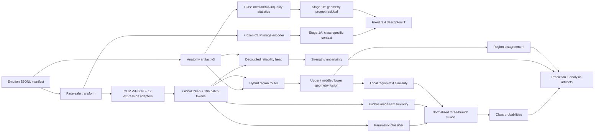

# Báo cáo GVHD: Tổng hợp hiện trạng công trình EmotionCLIP-ReID

**Vai trò trình bày:** Học viên cao học ngành Khoa học máy tính  
**Thời điểm kiểm toán:** 23/07/2026 (UTC+7)  
**Phiên bản mã nguồn:** commit `cffe8839e00543557ba7ec3114e22a419de41c52`, nhánh `old_branch`, working tree có thay đổi chưa commit  
**Phạm vi:** mã nguồn, cấu hình, notebook, manifest, test, artifact kết quả và 32 công trình trong thư mục `docs/research_review/`.

> **Kết luận ngắn:** repository hiện đã phát triển từ baseline CLIP-ReID thành một prototype FER hai giai đoạn có prompt cảm xúc, anatomy/geometry conditioning, expression adapter, ba nhánh phân loại, hybrid landmark routing và reliability tách khỏi xác suất lớp. Hai notebook đã ghi nhận lần chạy kiến trúc hiện tại trên validation tách riêng: RAF-DB hoàn tất bằng early stopping, còn FER2013 dừng ở Stage 2 epoch 29 vì gradient không hữu hạn. Kết quả này là **development evidence**, chưa phải kết quả cuối vì chưa có sealed-test, chưa có multi-seed/ablation, calibration còn kém và đã phát hiện sai lệch scale giữa Stage 1–Stage 2. Các con số cũ trong `outputs/` vẫn chỉ là kết quả lịch sử có leakage.

## 1. Quy ước mức bằng chứng

| Nhãn                 | Ý nghĩa                                                               | Có thể dùng để tuyên bố gì?                                    |
| --------------------- | ----------------------------------------------------------------------- | ---------------------------------------------------------------------- |
| **[CODE]**      | Đã hiện thực và được đối chiếu trong mã nguồn/cấu hình   | Có thể nói “hệ thống đã hỗ trợ/đã triển khai”            |
| **[TEST]**      | Đã được kiểm thử tự động hoặc kiểm tra artifact             | Có thể nói “đã xác minh ở mức unit/integration tương ứng” |
| **[HIST]**      | Kết quả cũ, sinh bởi phiên bản trước                            | Chỉ dùng để chứng minh pipeline cũ từng chạy được           |
| **[LIT]**       | Kết luận hoặc kiến trúc từ bài báo bên ngoài                  | Phải trích dẫn; không được nhận là đóng góp riêng         |
| **[CANDIDATE]** | Ý tưởng tự thiết kế đã có code nhưng chưa đủ thực nghiệm | Chỉ gọi là “đóng góp dự kiến/candidate contribution”         |
| **[PROPOSED]**  | Ý tưởng trong ghi chú/lộ trình, chưa có code hoàn chỉnh       | Không mô tả như chức năng hiện tại                             |

## 2. Tóm tắt điều hành cho GVHD

| Câu hỏi                                | Trả lời có bằng chứng                                                                                                                                                                                                                                                                                                                    |
| ---------------------------------------- | --------------------------------------------------------------------------------------------------------------------------------------------------------------------------------------------------------------------------------------------------------------------------------------------------------------------------------------------- |
| Công trình đang giải bài toán gì? | Nhận dạng biểu cảm khuôn mặt tĩnh, 7 lớp:`anger, disgust, fear, happiness, sadness, surprise, neutral`; đồng thời ước lượng độ không tin cậy và các tín hiệu giải thích theo vùng mặt.                                                                                                                           |
| Kế thừa gì?                           | Dual encoder và embedding chung của CLIP; prompt learning kiểu CoOp; chiến lược semantic anchoring hai giai đoạn của CLIP-ReID; residual adapter từ hướng parameter-efficient adaptation; Dirichlet/ECE/selective prediction từ literature về uncertainty.                                                                      |
| Đã tự phát triển gì?               | Schema anatomy v3 độc lập detector; thống kê geometry theo lớp bằng median/MAD/validity/uncertainty; prompt residual theo ba vùng; hybrid router landmark–learned attention; geometry fusion; fusion ba nhánh có scale control; reliability strength tách khỏi class logits; protocol split/provenance/checkpoint nghiêm ngặt. |
| Đã chạy được gì?                  | Full anatomy model hiện tại đã train trên RAF-DB đến early stop epoch 21 và trên FER2013 đến epoch 29; code compile được và 79/81 test đạt. Các anatomy artifact/checkpoint mới nằm ở môi trường JupyterHub và bằng chứng chạy được lưu trong output của notebook, chưa đồng bộ về checkout cục bộ. |
| Kết quả hiện tại ra sao?             | Validation hiện tại: RAF-DB tốt nhất ở Stage 2 epoch 1, accuracy 77,82%, macro-F1 62,69%; FER2013 tốt nhất đến epoch 27, accuracy 63,44%, macro-F1 50,80%. Đây chưa phải sealed-test và thấp hơn Stage 1/lịch sử, nên chỉ dùng để chẩn đoán. |
| Vướng mắc lớn nhất?                 | Scale logits Stage 2 không kế thừa scale CLIP của Stage 1; FER2013 dừng vì non-finite gradient dưới AMP; chưa có resume đầy đủ; 2 test notebook thất bại; region-disagreement config không khớp khóa runtime; inference RAF thiếu `--landmark`. |
| Trạng thái khoa học phù hợp nhất?  | **Prototype phương pháp đã hiện thực, đang ở giai đoạn cần chạy thí nghiệm chuẩn và ablation để xác nhận đóng góp.**                                                                                                                                                                                            |

## 3. Bài toán nghiên cứu và giả thuyết

### 3.1 Bài toán

FER in-the-wild khó vì che khuất, lệch pose, thay đổi danh tính/ánh sáng, mất cân bằng lớp và nhãn mơ hồ. Một classifier chỉ xuất softmax thường không cho biết mô hình sai vì biểu cảm nhập nhằng hay vì chất lượng quan sát kém. Công trình đặt câu hỏi:

> Có thể chuyển cơ chế semantic anchoring của CLIP-ReID sang FER, đồng thời dùng anatomy hình học để định tuyến patch và học reliability, nhằm cải thiện phân loại, tính bền vững và khả năng diễn giải hay không?

### 3.2 Các giả thuyết cần kiểm chứng

- **H1 – Semantic prompt:** prompt học được theo lớp cảm xúc tốt hơn class-name/manual prompt về macro-F1 và balanced accuracy.
- **H2 – Geometry prompt:** residual prompt từ thống kê anatomy của train split bổ sung thông tin hình học nhưng không phá hủy semantic anchor gốc.
- **H3 – Regional reasoning:** hybrid router theo landmark và learned attention tốt hơn `topk`, `free` hoặc `anatomy-only`, đặc biệt trên ảnh che khuất/lệch pose.
- **H4 – Reliability:** strength tách khỏi logits, kết hợp clean–corrupted ranking, giảm ECE/AURC mà không làm giảm đáng kể macro-F1.
- **H5 – Parameter efficiency:** adapter bottleneck có thể thích nghi miền FER trong khi giữ phần lớn CLIP backbone đóng băng.

Các giả thuyết trên **chưa được xác nhận** chỉ bằng việc có code; mỗi giả thuyết cần ablation và nhiều seed.

## 4. Phạm vi repository: hai pipeline song song

Repository vẫn chứa hai hệ thống:

1. **Legacy ReID pipeline:** `train.py`, `train_clipreid.py`, ReID datasets, TransReID-style backbone, ID/retrieval losses và CMC/mAP. Đây là nền mã lịch sử.
2. **EmotionCLIP FER pipeline:** `train_emotionclip.py`, `infer_emotionclip.py`, `datasets/anatomy.py`, `model/emotionclip_model.py`, `loss/emotion_losses.py`, `processor/processor_emotionclip.py`. Đây là công trình đang phát triển.

Hai pipeline không phải một mô hình joint ReID–FER. Từ “ReID” trong tên hiện thể hiện dòng kế thừa từ CLIP-ReID, không có nghĩa pipeline FER hiện tại đang tối ưu person re-identification.

## 5. Kiến trúc hiện tại



### 5.1 Quy ước ký hiệu

| Ký hiệu                                            | Ý nghĩa                                               |
| ---------------------------------------------------- | ------------------------------------------------------- |
| $B$, $N$                                         | Kích thước mini-batch và tổng số mẫu đánh giá |
| $K=7$                                              | Số lớp cảm xúc                                      |
| $R=3$                                              | Số vùng anatomy: upper, middle, lower                 |
| $D=512$                                            | Chiều không gian embedding chung của CLIP            |
| $i,c,r,p,j$                                        | Chỉ số mẫu, lớp, vùng, patch và landmark          |
| Chữ thường đậm$\mathbf{x}$                    | Vector; chữ hoa đậm$\mathbf{W}$ là ma trận       |
| $\widehat{\mathbf{x}}=\mathbf{x}/\|\mathbf{x}\|_2$ | Chuẩn hóa$\ell_2$                                   |
| $\operatorname{Concat}(\mathbf{a},\mathbf{b})$       | Phép nối tensor/vector theo chiều được nêu trong ngữ cảnh (token hoặc feature) |
| $\odot$                                            | Tích Hadamard theo từng phần tử                     |
| $\operatorname{sg}(\cdot)$                         | Stop-gradient/detach                                    |
| $\mathbb{1}[\cdot]$                                | Hàm chỉ thị                                          |

Toàn bộ logarit trong các công thức là logarit tự nhiên. Các phép softmax không ghi rõ chiều được thực hiện trên chiều lớp; softmax có chỉ số, chẳng hạn $\operatorname{softmax}_{p}$, được thực hiện trên chỉ số đó.

### 5.2 Backbone CLIP

- **[LIT/CODE]** Backbone là OpenAI CLIP ViT-B/16: image encoder và text encoder chiếu ảnh/văn bản về không gian embedding chung. Ý tưởng nền tảng đến từ [CLIP, Radford et al., ICML 2021](https://proceedings.mlr.press/v139/radford21a.html).
- Ảnh được resize/crop về `224×224`, stride `16`, tạo lưới `14×14 = 196` patch token cộng một CLS/global token.
- Text encoder được đóng băng; visual backbone mặc định cũng không fine-tune nguyên block (`TRAIN_LAST_BLOCKS: 0`), chỉ adapter và các head mới được học ở Stage 2.

### 5.3 Expression adapter

Mỗi trong 12 Transformer block của CLIP visual encoder có một residual bottleneck:

$$
\begin{aligned}
\mathbf{h}
&= \operatorname{Dropout}\!\left(
   \operatorname{QuickGELU}\!\left(
   \mathbf{W}_{\mathrm{down}}\mathbf{x}
   + \mathbf{b}_{\mathrm{down}}
   \right)\right), \\
\operatorname{Adapter}(\mathbf{x})
&= \mathbf{W}_{\mathrm{up}}\mathbf{h}
   + \mathbf{b}_{\mathrm{up}}, \\
\mathbf{x}'
&= \mathbf{x}+\operatorname{Adapter}(\mathbf{x}).
\end{aligned}
\tag{1}
$$

Trong đó $\mathbf{x}\in\mathbb{R}^{768}$, $\mathbf{h}\in\mathbb{R}^{64}$; do đó bottleneck có dạng $768\rightarrow64\rightarrow768$. Hai tham số $\mathbf{W}_{\mathrm{up}}$ và $\mathbf{b}_{\mathrm{up}}$ được khởi tạo bằng 0, nên tại thời điểm bắt đầu $\operatorname{Adapter}(\mathbf{x})=\mathbf{0}$ và block giữ gần nguyên hành vi CLIP gốc. Cấu trúc có quan hệ với parameter-efficient visual adapters như [AdaptFormer, NeurIPS 2022](https://proceedings.neurips.cc/paper_files/paper/2022/hash/69e2f49ab0837b71b0e0cb7c555990f8-Abstract-Conference.html) và đặc biệt gần hướng expression-aware adapter của EA-CLIP, nhưng cách chèn, zero-init và chính sách freeze là hiện thực riêng của repository.

### 5.4 Prompt cảm xúc và semantic anchor

Trong hàm khởi tạo, code tạo chuỗi tạm sau để CLIP tokenizer xác định vị trí bốn context token:

```text
A photo of a face with X X X X showing a {emotion} expression.
```

Các ký hiệu `X` ở đây chỉ là **placeholder khi tokenize**, không phải biểu diễn cuối được đưa vào text Transformer. Trong `forward`, bốn embedding tại các vị trí này được thay bằng learned context vectors; nếu bật geometry conditioning, tensor prompt thực tế đúng là:

```text
A photo of a face with
[V0]
[V1 + Δupper]
[V2 + Δmiddle]
[V3 + Δlower]
showing a {emotion} expression.
```

Viết chính xác dưới dạng toán học:

$$
\begin{aligned}
\mathcal{P}^{\mathrm{base}}_c
&=
\operatorname{Concat}\!\left(
\mathcal{P}_{\mathrm{pre}},
\bigl[
\mathbf{v}_{c,0},
\mathbf{v}_{c,1},
\mathbf{v}_{c,2},
\mathbf{v}_{c,3}
\bigr],
\mathcal{P}_{\mathrm{suf}}(c)
\right), \\
\mathcal{P}^{\mathrm{geo}}_c
&=
\operatorname{Concat}\!\left(
\mathcal{P}_{\mathrm{pre}},
\bigl[
\mathbf{v}_{c,0},
\mathbf{v}_{c,1}+\Delta\mathbf{p}_{c,\mathrm{upper}},
\mathbf{v}_{c,2}+\Delta\mathbf{p}_{c,\mathrm{middle}},
\mathbf{v}_{c,3}+\Delta\mathbf{p}_{c,\mathrm{lower}}
\bigr],
\mathcal{P}_{\mathrm{suf}}(c)
\right), \\
&\hspace{8em}c\in\{1,\ldots,K\}.
\end{aligned}
\tag{2}
$$

Với $\operatorname{Concat}$ là phép nối tensor theo chiều token, $K=7$, và $\mathbf{v}_{c,j}\in\mathbb{R}^{512}$ là learned context vector thứ $j$ của lớp $c$. Đây **không phải phép cộng**; phép cộng chỉ xuất hiện giữa ba context vector cuối và residual tương ứng. Ánh xạ này khớp trực tiếp với phép gán `ctx[:, 1:4] = ctx[:, 1:4] + geometry` trong code:

- Bốn context token là **class-specific**, tổng số tham số Stage 1A là $K\times4\times512=14\,336$.
- $\mathbf{v}_{c,0}$ là context token nền của lớp $c$, không nhận anatomy residual.
- $\mathbf{v}_{c,1}$, $\mathbf{v}_{c,2}$ và $\mathbf{v}_{c,3}$ lần lượt nhận $\Delta_{\mathrm{upper}}$, $\Delta_{\mathrm{middle}}$ và $\Delta_{\mathrm{lower}}$.
- Suffix chính xác trong code hiện là `showing a {emotion} expression.`, không phải `showing an [emotion] expression.`. Nếu đổi mạo từ hoặc đổi emotion noun sang adjective, cần sửa cả `prompt_suffix_template` và tái huấn luyện Stage 1 để bảo đảm checkpoint tương thích.
- Continuous prompt learning kế thừa trực tiếp logic của [CoOp](https://arxiv.org/abs/2109.01134).
- Cơ chế huấn luyện descriptor trước rồi cố định làm text anchor kế thừa khung hai giai đoạn của [CLIP-ReID](https://arxiv.org/abs/2211.13977), nhưng thay ID-specific token bằng emotion-class descriptor.

### 5.5 Stage 1A và Stage 1B

**Stage 1A – base prompt:** image/text encoder đóng băng; tối ưu context token bằng cross-entropy trên similarity ảnh–text.

Gọi $\widehat{\mathbf{z}}_i\in\mathbb{R}^{D}$ là image feature đã chuẩn hóa của mẫu $i$, $\widehat{\mathbf{t}}_c$ là text descriptor đã chuẩn hóa của lớp $c$, và $\gamma=\exp(s_{\mathrm{CLIP}})$ là logit scale của CLIP. Stage 1A dùng:

$$
\ell^{(1)}_{i,c}
=
\gamma\,\widehat{\mathbf{z}}_i^{\top}\widehat{\mathbf{t}}_c,
\qquad
\mathcal{L}_{\mathrm{S1A}}
=
-\frac{1}{B}\sum_{i=1}^{B}
\log
\frac{\exp\!\left(\ell^{(1)}_{i,y_i}\right)}
{\sum_{c=1}^{K}\exp\!\left(\ell^{(1)}_{i,c}\right)}.
\tag{3}
$$

**Stage 1B – geometry residual:** khôi phục checkpoint tốt nhất của Stage 1A; đóng băng context cơ sở và chỉ học anatomy residual. Điều kiện của mỗi vùng gồm:

$$
\begin{aligned}
\bar{\boldsymbol{\nu}}_{c,r}
&=\min\!\left(\mathbf{1},\max\!\left(\mathbf{0},\boldsymbol{\nu}_{c,r}\right)\right),
\qquad
\mathbf{d}^{+}_{c,r}=\max\!\left(\mathbf{0},\mathbf{d}_{c,r}\right), \\
\mathbf{u}^{+}_{c,r}
&=\max\!\left(\mathbf{0},\mathbf{u}_{c,r}\right), \\
\mathbf{g}_{c,r}
&=
\operatorname{Concat}\!\left(
\mathbf{m}_{c,r}\odot\bar{\boldsymbol{\nu}}_{c,r},
\log\!\left(\mathbf{1}+\mathbf{d}^{+}_{c,r}\right)\odot\bar{\boldsymbol{\nu}}_{c,r},
\bar{\boldsymbol{\nu}}_{c,r},
\mathbf{u}^{+}_{c,r}\odot\bar{\boldsymbol{\nu}}_{c,r}
\right).
\end{aligned}
\tag{4}
$$

$$
\Delta\mathbf{p}_{c,r}
=
\operatorname{sigmoid}\!\left(a_r^{\mathrm{prompt}}\right)q_{c,r}\,
\tanh\!\left(f_r^{\mathrm{prompt}}\!\left(\mathbf{g}_{c,r}\right)\right),
\qquad
r\in\{\mathrm{upper},\mathrm{middle},\mathrm{lower}\}.
\tag{5}
$$

Trong đó $\mathbf{m}$ là median, $\mathbf{d}=1{,}4826\,\mathrm{MAD}$ là robust scale, $\boldsymbol{\nu}$ là valid rate, $\mathbf{u}$ là uncertainty và $q_{c,r}\in[0,1]$ là region quality. Các phép $\min/\max$ giữa vector trong (4) được hiểu theo từng phần tử, khớp với `clamp` trong code. Ký hiệu $a_r^{\mathrm{prompt}}$ tách biệt gate của prompt khỏi gate geometry phía visual; $\odot$ là tích Hadamard. Mỗi $f_r^{\mathrm{prompt}}$ là MLP $48\rightarrow32\rightarrow512$.

Đặt $\widehat{\mathbf{t}}^{\mathrm{base}}_c$ là descriptor trước geometry conditioning. Loss Stage 1B được chuẩn hóa thành:

$$
\begin{aligned}
\mathcal{L}_{\mathrm{shift}}
&=
\frac{1}{KRD}
\sum_{c=1}^{K}\sum_{r=1}^{R}
\left\|\Delta\mathbf{p}_{c,r}\right\|_2^2, \\
\mathcal{L}_{\mathrm{sem}}
&=
\max\!\left\{
0,
1-\frac{1}{K}\sum_{c=1}^{K}
\cos\!\left(
\widehat{\mathbf{t}}_c,
\widehat{\mathbf{t}}^{\mathrm{base}}_c
\right)
\right\}, \\
\mathcal{L}_{\mathrm{S1B}}
&=
\mathcal{L}_{\mathrm{CE}}^{(1)}
+\lambda_{\mathrm{shift}}\mathcal{L}_{\mathrm{shift}}
+\lambda_{\mathrm{sem}}\mathcal{L}_{\mathrm{sem}}.
\end{aligned}
\tag{6}
$$

Ở đây $R=3$ là số vùng anatomy và $D=512$ là chiều residual prompt.

Cấu hình chính dùng $\lambda_{\mathrm{shift}}=0.01$ và $\lambda_{\mathrm{sem}}=0.1$. Đây là **[CANDIDATE]**: thiết kế class median/MAD/quality conditioning chưa được chứng minh mới về mặt học thuật nếu chưa hoàn tất novelty search và ablation.

### 5.6 Ba nhánh dự đoán

Stage 2 tạo ba logits:

1. `s_cls`: linear classifier trên global feature.
2. `s_global`: cosine similarity giữa normalized global feature và text descriptors.
3. `s_local`: tổng có trọng số của logits từ ba vùng anatomy.

Với mẫu $i$ và lớp $c$, gọi $\eta_{i,r}$ là trọng số importance của vùng $r$. Ba nhánh được viết:

$$
\begin{aligned}
s^{\mathrm{cls}}_{i,c}
&=
\left(\mathbf{W}_{\mathrm{cls}}\widehat{\mathbf{z}}^{g}_i
+\mathbf{b}_{\mathrm{cls}}\right)_c, \\
s^{\mathrm{global}}_{i,c}
&=
\left(\widehat{\mathbf{z}}^{g}_i\right)^{\top}
\widehat{\mathbf{t}}_c, \\
s^{\mathrm{local}}_{i,c}
&=
\sum_{r=1}^{R}\eta_{i,r}\,
\widehat{\mathbf{h}}_{i,r}^{\top}\widehat{\mathbf{t}}_c,
\qquad
\sum_{r=1}^{R}\eta_{i,r}=1.
\end{aligned}
\tag{7}
$$

Trước khi fusion, mỗi nhánh có thể được chuẩn hóa bằng learned temperature hoặc RMS. Với tập nhánh $\mathcal{B}=\{\mathrm{cls},\mathrm{global},\mathrm{local}\}$, temperature fusion là:

$$
\begin{aligned}
\widetilde{s}^{\,b}_{i,c}
&=
\frac{s^{b}_{i,c}}{\tau_b},
\qquad
\tau_b
=
\tau_{\min}
+(\tau_{\max}-\tau_{\min})\operatorname{sigmoid}(\theta_b), \\
\mathbf{w}_i
&=
\begin{cases}
\boldsymbol{\pi},
& \texttt{fixed}, \\
\operatorname{softmax}(\mathbf{a}),
& \texttt{simplex}, \\
\operatorname{softmax}\!\left(g(\widehat{\mathbf{z}}^{g}_i)\right),
& \texttt{sample\_dependent},
\end{cases} \\
&\hspace{1.4em}w_{i,b}\ge 0,
\qquad
\sum_{b\in\mathcal{B}}w_{i,b}=1, \\
s_{i,c}
&=
\sum_{b\in\mathcal{B}}
w_{i,b}\widetilde{s}^{\,b}_{i,c}, \\
s^{\mathrm{align}}_{i,c}
&=
\frac{1}{2}
\left(
\widetilde{s}^{\,\mathrm{global}}_{i,c}
+\widetilde{s}^{\,\mathrm{local}}_{i,c}
\right).
\end{aligned}
\tag{8}
$$

Các mode hiện có: `fixed`, `simplex`, `sample_dependent`. Ở đây $\boldsymbol{\pi}$ là prior đã chuẩn hóa, $\mathbf{a}$ là vector logit dùng chung và $g$ là MLP gate theo mẫu. Cấu hình chính dùng `fixed` với prior thô $(1,1,0.5)$, tương đương $\mathbf{w}=(0.4,0.4,0.2)$ sau chuẩn hóa. Vì vậy $\mathcal{L}_{\mathrm{gate}}=0$ trong cấu hình `fixed`; hệ số `LAMBDA_GATE=0.01` không tạo gradient cho gate ở run này.

**Sai lệch scale đã xác minh:** Stage 1 nhân cosine similarity với $\exp(s_{\mathrm{CLIP}})$, còn Stage 2 bỏ hệ số này và khởi tạo $\tau_b=1$. Trong log run mới, cosine logits chỉ cỡ $0{,}1$–$0{,}3$, trong khi temperature sau hàng chục epoch vẫn khoảng $0{,}97$–$1{,}00$. Kết quả là softmax gần đều, confidence chỉ $0{,}15$–$0{,}23$. Cận $\tau_{\min}=0{,}05$ cũng chỉ cho scale tối đa $20$, thấp hơn scale CLIP Stage 1 thường dùng. Đây là một nguyên nhân trực tiếp khiến chuyển từ Stage 1 sang Stage 2 làm giảm macro-F1; cần sửa hoặc ablate trước khi kết luận về anatomy/reliability.

### 5.7 Hybrid anatomy router

Ba query học được tạo `free_attention` trên patch token. Gọi $\mathbf{q}_r$ là learned query của vùng $r$, $\mathbf{z}_{i,p}$ là feature của patch $p$, $\mathbf{W}_k$ là key projection và $D$ là chiều feature:

$$
A^{\mathrm{free}}_{i,r,p}
=
\operatorname{softmax}_{p}\!\left(
\frac{\mathbf{q}_r^{\top}\mathbf{W}_k\mathbf{z}_{i,p}}
{\sqrt{D}}
\right).
\tag{9}
$$

Với landmark $j$ có tọa độ chuẩn hóa $\boldsymbol{\ell}_{i,r,j}$, uncertainty $u_{i,r,j}$, trọng số $\omega_{i,r,j}$, mask $m_{i,r,j}$ và tâm patch $\mathbf{c}_p$, đặt $u^+_{i,r,j}=\max(0,u_{i,r,j})$. Anatomical attention là Gaussian mixture đã chuẩn hóa:

$$
\begin{aligned}
G_{i,r,j,p}
&=
\exp\!\left[
-\frac{
\left\|\boldsymbol{\ell}_{i,r,j}-\mathbf{c}_p\right\|_2^2
}{
2\max\!\left\{
10^{-8},
\sigma^2\left(1+u^+_{i,r,j}\right)^2
\right\}
}
\right], \\
\widetilde{A}^{\mathrm{anat}}_{i,r,p}
&=
\sum_j
m_{i,r,j}\omega_{i,r,j}G_{i,r,j,p}, \\
A^{\mathrm{anat}}_{i,r,p}
&=
\frac{
\widetilde{A}^{\mathrm{anat}}_{i,r,p}
}{
\max\!\left(
\varepsilon_{\mathrm{a}},
\sum_{p'}\widetilde{A}^{\mathrm{anat}}_{i,r,p'}
\right)
}.
\end{aligned}
\tag{10}
$$

Công thức (10) áp dụng khi tổng trọng số landmark sau mask là dương; nếu không, $A^{\mathrm{anat}}_{i,r,p}=0$ và $\rho_{i,r}=0$, nên hybrid route tự lùi về $A^{\mathrm{free}}$.

Gọi $\rho_{i,r}\in[0,1]$ là region quality sau khi xét tính hợp lệ của landmark. Hybrid route và routed feature là:

$$
\begin{aligned}
A^{\mathrm{hyb}}_{i,r,p}
&=
\rho_{i,r}A^{\mathrm{anat}}_{i,r,p}
+\left(1-\rho_{i,r}\right)A^{\mathrm{free}}_{i,r,p}, \\
\mathbf{z}^{r}_{i,r}
&=
\sum_{p}A^{\mathrm{hyb}}_{i,r,p}\mathbf{z}_{i,p}.
\end{aligned}
\tag{11}
$$

Trong mode `hybrid`, routing loss trong code có dạng:

$$
\mathcal{L}_{\mathrm{route}}
=
-\frac{
\sum_{i,r}\rho_{i,r}
\log\!\left[
\max\!\left(
\varepsilon_{\mathrm{o}},
\sum_p
A^{\mathrm{free}}_{i,r,p}
\operatorname{sg}\!\left(A^{\mathrm{anat}}_{i,r,p}\right)
\right)
\right]
}{
\max\!\left(1,\sum_{i,r}\rho_{i,r}\right)
},
\tag{12}
$$

trong đó $\operatorname{sg}(\cdot)$ là stop-gradient/detach, $\varepsilon_{\mathrm{a}}=10^{-8}$ ổn định phép chuẩn hóa anatomical attention và $\varepsilon_{\mathrm{o}}=10^{-4}$ chặn overlap trước phép log.

Trong mode `hybrid`, routing loss khuyến khích learned attention chồng lấp anatomical attention đã detach. Khi anatomy không hợp lệ, router tự lùi về learned attention. Các pure ablation `topk`, `free`, `anatomy` cũng đã có trong code.

### 5.8 Geometry fusion theo ba vùng

Mỗi vùng `upper/middle/lower` có:

- routed visual feature;
- geometry encoder từ `[feature×validity, validity, uncertainty]`;
- quality-gated, zero-initialized residual;
- region-text logits;
- learned region importance.

Mode mặc định là `gated_residual`; code còn hỗ trợ `cross_attention` trên từng landmark token `(x, y, weight, uncertainty)`. Region disagreement được tính bằng weighted Jensen–Shannon divergence và chỉ hợp lệ khi đủ số vùng có chất lượng.

Với mode `gated_residual`, feature vùng sau geometry fusion là:

$$
\begin{aligned}
\mathbf{e}_{i,r}^{\mathrm{geo}}
&=
\operatorname{Concat}\!\left(
\mathbf{x}_{i,r}^{\mathrm{geo}}\odot\mathbf{m}_{i,r}^{\mathrm{geo}},
\mathbf{m}_{i,r}^{\mathrm{geo}},
\mathbf{u}_{i,r}^{\mathrm{geo}}
\right), \\
\mathbf{h}_{i,r}
&=
\operatorname{LN}_r\!\left[
\mathbf{z}^{r}_{i,r}
+\operatorname{sigmoid}\!\left(a_r^{\mathrm{vis}}\right)\rho_{i,r}
\tanh\!\left(f_r^{\mathrm{vis}}(\mathbf{e}_{i,r}^{\mathrm{geo}})\right)
\right].
\end{aligned}
\tag{13}
$$

Ở đây $\mathbf{x}_{i,r}^{\mathrm{geo}}\in\mathbb{R}^{12}$ là geometry feature, $\mathbf{m}_{i,r}^{\mathrm{geo}}\in\{0,1\}^{12}$ là validity mask và $\mathbf{u}_{i,r}^{\mathrm{geo}}\in\mathbb{R}_{\ge0}^{12}$ là uncertainty. Do đó $f_r^{\mathrm{vis}}$ nhận vector 36 chiều và khác hoàn toàn $f_r^{\mathrm{prompt}}$ trong (5).

Region importance và local logits được tính theo:

$$
\eta_{i,r}
=
\operatorname{softmax}_{r}\!\left(
g_{\phi}\!\left(
\operatorname{Concat}(\mathbf{h}_{i,r},\rho_{i,r})
\right)
\right),
\qquad
s^{\mathrm{local}}_{i,c}
=
\sum_{r=1}^{R}
\eta_{i,r}
\widehat{\mathbf{h}}_{i,r}^{\top}
\widehat{\mathbf{t}}_c.
\tag{14}
$$

Để đo bất đồng giữa các vùng, đặt $\mathbf{p}_{i,r}=\operatorname{softmax}(\mathbf{s}_{i,r})$, $\bar{\omega}_{i,r}=\rho_{i,r}/\max(10^{-8},\sum_{r'}\rho_{i,r'})$ và $\bar{\mathbf{p}}_i=\sum_r\bar{\omega}_{i,r}\mathbf{p}_{i,r}$. Mẫu không có quality hợp lệ nhận toàn bộ trọng số bằng 0 và sau đó bị validity gate loại. Weighted Jensen–Shannon divergence là:

$$
\begin{aligned}
D_{\mathrm{JSD},i}
&=
H_{\varepsilon}\!\left(\bar{\mathbf{p}}_i\right)
-
\sum_{r=1}^{R}
\bar{\omega}_{i,r}H_{\varepsilon}\!\left(\mathbf{p}_{i,r}\right),
\qquad
H_{\varepsilon}(\mathbf{p})=-\sum_{c=1}^{K}p_c\log\!\left(\max\{10^{-8},p_c\}\right), \\
v_i^{\mathrm{JSD}}
&=
\mathbb{1}\!\left[
\sum_r\rho_{i,r}\ge q_{\min}
\right]
\mathbb{1}\!\left[
\sum_r\mathbb{1}(\rho_{i,r}>0)\ge R_{\min}
\right], \\
d_i^{\mathrm{region}}
&=
v_i^{\mathrm{JSD}}\max\!\left(0,D_{\mathrm{JSD},i}\right).
\end{aligned}
\tag{15}
$$

Trong hiện thực hiện tại, $q_{\min}=0{,}5$ và $R_{\min}=2$. Giá trị YAML `MIN_REGION_QUALITY: 0.2` chưa có hiệu lực vì builder đang đọc nhầm khóa `QUALITY_THRESHOLD`; `MIN_EFFECTIVE_REGIONS: 1.5` cũng mới chỉ được validate, chưa tham gia công thức hay forward pass.

### 5.9 Reliability tách khỏi class probability

Thay vì biến trực tiếp độ lớn logits thành evidence, mô hình dùng một reliability head riêng trên:

- global feature 512 chiều (detach mặc định);
- 3 region qualities;
- minimum quality, mean quality, valid-region ratio, pose quality và crop quality.

Tổng input là 520 chiều, qua `LayerNorm → Linear(520,128) → GELU → Dropout → Linear(128,1)`. Reliability context của mẫu $i$ được viết:

$$
\mathbf{c}_i
=
\operatorname{Concat}\!\left(
\operatorname{sg}(\widehat{\mathbf{z}}^{g}_i),
\boldsymbol{\rho}_i,
\rho_i^{\min},
\rho_i^{\mathrm{mean}},
\rho_i^{\mathrm{valid}},
q_i^{\mathrm{pose}},
q_i^{\mathrm{crop}}
\right)
\in\mathbb{R}^{520}.
\tag{16}
$$

Gọi $h_{\psi}$ là reliability head, $R_{\max}=20$ là chặn trị tuyệt đối của raw strength và $S_{\max}=100$ là strength tối đa:

$$
\begin{aligned}
\widetilde{r}_i
&=h_{\psi}(\mathbf{c}_i), \\
r_i
&=R_{\max}\tanh\!\left(
\frac{\widetilde{r}_i}{R_{\max}}
\right), \\
S_i
&=\min\!\left\{
S_{\max},
K+\operatorname{softplus}(r_i)
\right\}, \\
\mathbf{p}_i
&=\operatorname{softmax}(\mathbf{s}_i), \\
\alpha_{i,c}
&=1+\operatorname{sg}(p_{i,c})(S_i-K), \\
\widehat{p}^{\mathrm{Dir}}_{i,c}
&=\frac{\alpha_{i,c}}{S_i}, \\
u_i
&=\frac{K}{S_i}.
\end{aligned}
\tag{17}
$$

Ở đây $K=7$, $\mathbf{p}_i$ là xác suất phân loại dùng để dự đoán, còn $\widehat{\mathbf{p}}^{\mathrm{Dir}}_i=\boldsymbol{\alpha}_i/S_i$ là kỳ vọng của phân phối Dirichlet. Ký hiệu $\operatorname{sg}$ trong $\alpha_{i,c}$ phản ánh đúng cấu hình mặc định `DETACH_CLASS_PROB: true`; nếu tắt tùy chọn này thì bỏ $\operatorname{sg}$. Cách tách $\mathbf{p}_i$ và $S_i$ tránh việc một phép cộng hằng số vào logits làm thay đổi uncertainty. Dirichlet formulation có nền từ [Evidential Deep Learning, Sensoy et al., NeurIPS 2018](https://proceedings.neurips.cc/paper/2018/hash/a981f2b708044d6fb4a71a1463242520-Abstract.html), nhưng default objective `correctness BCE` và decoupled strength là hiện thực tùy biến, không phải EDL nguyên bản.

Ranh giới diễn giải: reliability head chỉ thay đổi $S_i$, $\boldsymbol{\alpha}_i$ và $u_i$; nó **không hiệu chỉnh trực tiếp** $\mathbf{p}_i=\operatorname{softmax}(\mathbf{s}_i)$. Vì metric ECE/NLL/Brier hiện tính trên $\mathbf{p}_i$, không được tuyên bố rằng correctness-BCE tự nó calibrate class probability. Hơn nữa, $u_i=K/S_i$ chỉ đơn điệu theo $r_i$ chứ không phải xác suất lỗi đã được chuẩn hóa; hiệu quả phù hợp nhất để kiểm bằng error-AUROC/AUPR, AURC và risk-at-coverage.

Mô hình xuất ba tín hiệu khác nhau:

- `class_ambiguity`: $H(\mathbf{p}_i)$ — entropy của softmax, biểu thị các lớp đang cạnh tranh;
- `extrinsic_unreliability`: $u_i=K/S_i$ — chất lượng/bằng chứng quan sát;
- `region_disagreement`: các vùng mặt có bất đồng hay không.

Không nên gộp ba đại lượng thành một khái niệm “uncertainty” duy nhất khi trình bày.

## 6. Dữ liệu và anatomy artifact

### 6.1 Manifest và lớp cảm xúc

Mỗi dòng JSONL chứa tối thiểu `image_path`, `emotion`/`emotion_id`, `split`; có thể có `video_id`, `subject_id`, AU metadata và anatomy artifact. Split leakage được kiểm tra theo `image_path`, `video_id`, `subject_id`.

| Dataset cục bộ     |  Train | Validation |  Test | Anatomy manifest yêu cầu                                           |
| -------------------- | -----: | ---------: | ----: | -------------------------------------------------------------------- |
| RAF-DB               |  9.818 |      2.453 | 3.068 | `data/RAF-DB/manifest_anatomy.jsonl` — **đang thiếu**     |
| Hugging Face FER2013 | 28.709 |      3.589 | 3.589 | `data/hf_fer2013/manifest_anatomy.jsonl` — **đang thiếu** |

FER2013 bắt nguồn từ facial-expression challenge được mô tả trong [Goodfellow et al., 2013](https://arxiv.org/abs/1307.0414). RAF-DB là cơ sở dữ liệu biểu cảm thực địa quy mô lớn của Li và Deng; mô tả chính thức có tại [IEEE TIP/PubMed](https://pubmed.ncbi.nlm.nih.gov/30183631/).

### 6.2 Schema anatomy v3

`datasets/anatomy.py` định nghĩa artifact detector-agnostic, tương thích chỉ mục 468 landmark của MediaPipe Face Mesh. Việc phát hiện landmark được thực hiện offline bởi `tools/build_face_landmark_artifacts.py`; runtime training không phụ thuộc MediaPipe. Nguồn kiến trúc detector/mesh cần ghi là [MediaPipe Face Mesh, Kartynnik et al., 2019](https://arxiv.org/abs/1907.06724).

Artifact lưu:

- tọa độ `x, y, z`, visibility/confidence và mask hợp lệ;
- landmark uncertainty và feature-unit jitter;
- pose/crop/detector metadata;
- geometry feature, validity, uncertainty và region quality;
- ba vùng ổn định `upper`, `middle`, `lower`.

| Vùng  | Số feature định nghĩa | Nội dung chính                                                                  |
| ------ | ------------------------: | --------------------------------------------------------------------------------- |
| Upper  |                        10 | eye aspect ratio, brow–eye distance/slope, symmetry, curvature                   |
| Middle |                         7 | nose/face size, eye–mouth distance, cheek/asymmetry                              |
| Lower  |                         9 | mouth aspect ratio, width/opening, corner elevation, lip curvature, jaw/asymmetry |

Mỗi vùng được pad tới `MAX_GEOMETRY_FEATURES=12`. Landmark thiếu **không được impute**; validity và uncertainty đi cùng feature để mô hình biết đâu là dữ liệu quan sát được. Crop/resize/flip được áp dụng đồng bộ lên ảnh và landmark; horizontal flip hoán đổi các slot trái–phải.

### 6.3 AU hiện chưa đi vào mô hình

Các trường `au_labels` và `au_text` được parser giữ lại như metadata, nhưng không có consumer trong model, loss hay processor. Vì vậy:

- không được nói mô hình hiện tại là “AU-supervised”;
- không được nói đang có AU-text fusion;
- mô tả đúng là **landmark/geometry-conditioned FER**;
- MER-CLIP, VL-FAU, AUFormer... là related work hoặc hướng mở rộng.

Nếu dùng thuật ngữ AU/FACS, nguồn gốc cần bổ sung là Ekman & Friesen, *Facial Action Coding System* (1978); FACS mô tả chuyển động cơ bản bằng Action Units, không tự động đồng nhất AU với nhãn cảm xúc.

## 7. Huấn luyện, loss và tham số

### 7.1 Cấu hình chuẩn hiện tại

| Thành phần     | Giá trị chính                                                                                                                                                                                 |
| ---------------- | ------------------------------------------------------------------------------------------------------------------------------------------------------------------------------------------------ |
| Backbone         | CLIP ViT-B/16, image$224\times224$, stride 16                                                                                                                                                  |
| Stage 1          | mode`both`; base 20 epoch; geometry 10 epoch; batch 64; $\mathrm{LR}=3.5\times10^{-4}$                                                                                                       |
| Stage 2          | 30 epoch; batch 32;$\mathrm{LR}=5\times10^{-6}$; weight decay $10^{-4}$                                                                                                                      |
| Adapter          | dim 64; dropout 0; 12 blocks; full last block trainable = 0                                                                                                                                      |
| Routing/geometry | `hybrid`; $\sigma=0.08$; `gated_residual`                                                                                                                                                  |
| Fusion           | fixed gate; learned temperature$\tau_b\in[0.05,20]$                                                                                                                                            |
| Loss weights     | $\beta_{\mathrm{align}}=0.5$; $\lambda_{\mathrm{rel}}=0.05$; $\lambda_{\mathrm{gate}}=0.01$; $\lambda_{\tau}=0.001$; $\lambda_{\mathrm{route}}=0.05$; $\lambda_{\mathrm{rank}}=0.05$ |
| Corruption       | probability $0.5$ theo batch; Gaussian noise std $0.08$ trên tensor đã normalize; cạnh ô che bằng $0.2$ chiều cao/rộng; margin $m=1$ |

Đây là YAML chính, không phải cấu hình hiệu lực của hai run mới trong notebook. Notebook ngày 22–23/07 đã override thành Stage 1A/1B `50/50`, Stage 2 tối đa 50 epoch; RAF-DB dùng micro-batch `16`, accumulation `8`, còn FER2013 dùng micro-batch `64`, accumulation `2`. Do early stopping, RAF dừng Stage 2 ở epoch 21; FER dừng bất thường giữa epoch 29.

Tên `OCCLUSION_RATIO=0.2` dễ gây hiểu nhầm: code lấy $0.2H\times0.2W$, nên diện tích che xấp xỉ $4\%$ ảnh chứ không phải $20\%$. Giá trị `0.0` được ghi vào tensor đã CLIP-normalize nên tương ứng màu trung bình, không phải pixel đen trong ảnh gốc.

### 7.2 Loss Stage 2

Với batch $B$, cross-entropy của final logits và alignment logits lần lượt là:

$$
\mathcal{L}_{\mathrm{cls}}
=
-\frac{1}{B}\sum_{i=1}^{B}
\log\operatorname{softmax}(\mathbf{s}_i)_{y_i},
\qquad
\mathcal{L}_{\mathrm{align}}
=
-\frac{1}{B}\sum_{i=1}^{B}
\log\operatorname{softmax}(\mathbf{s}^{\mathrm{align}}_i)_{y_i}.
\tag{18}
$$

Default reliability target là tính đúng/sai của quyết định lớp đã detach:

$$
t_i
=
\mathbb{1}\!\left[
\arg\max_c \operatorname{sg}(s_{i,c})=y_i
\right],
\qquad
\mathcal{L}_{\mathrm{rel}}
=
-\frac{1}{B}\sum_{i=1}^{B}
\left[
t_i\log\operatorname{sigmoid}(r_i)
+(1-t_i)\log\!\left(1-\operatorname{sigmoid}(r_i)\right)
\right].
\tag{19}
$$

Mã nguồn áp ranking trực tiếp lên **raw reliability logit** $r_i$, không phải Dirichlet strength $S_i$. Với ảnh sạch và ảnh corrupted, loss chính xác là:

$$
\mathcal{L}_{\mathrm{rank}}
=
\frac{1}{B}\sum_{i=1}^{B}
\max\!\left(
0,
m+r_i^{\mathrm{corr}}-r_i^{\mathrm{clean}}
\right),
\tag{20}
$$

trong đó $m$ là ranking margin. Với default target `correctness`, tổng loss Stage 2 là:

$$
\begin{aligned}
\mathcal{L}_{\mathrm{S2}}
={}&
\mathcal{L}_{\mathrm{cls}}
+\beta_{\mathrm{align}}\mathcal{L}_{\mathrm{align}}
+\lambda_{\mathrm{rel}}a_t\mathcal{L}_{\mathrm{rel}} \\
&+\lambda_{\mathrm{gate}}\mathcal{L}_{\mathrm{gate}}
+\lambda_{\tau}\mathcal{L}_{\mathrm{temp}}
+\lambda_{\mathrm{route}}\mathcal{L}_{\mathrm{route}}
+\lambda_{\mathrm{rank}}\mathcal{L}_{\mathrm{rank}}.
\end{aligned}
\tag{21}
$$

với $a_t\in[0,1]$ là hệ số warm-up/annealing của reliability. Hai regularizer của fusion là:

$$
\mathcal{L}_{\mathrm{gate}}
=
D_{\mathrm{KL}}\!\left(
\overline{\mathbf{w}}\,\|\,\boldsymbol{\pi}
\right),
\qquad
\mathcal{L}_{\mathrm{temp}}
=
\frac{1}{|\mathcal{B}|}
\sum_{b\in\mathcal{B}}
\left(
\log\tau_b-\log\tau_b^{(0)}
\right)^2,
\tag{22}
$$

trong đó $\overline{\mathbf{w}}=B^{-1}\sum_i\mathbf{w}_i$ và $\boldsymbol{\pi}$ là fusion prior.

- Default $\mathcal{L}_{\mathrm{rel}}$ là BCE dự đoán quyết định class hiện tại đúng/sai; target class decision được detach.
- Mode thay thế `edl` dùng evidential CE + KL-to-uniform.
- $\mathcal{L}_{\mathrm{rank}}$ yêu cầu raw reliability logit của ảnh sạch cao hơn ảnh bị noise/occlusion ít nhất một margin $m$. Do $S_i=K+\operatorname{softplus}(r_i)$ là phi tuyến, không được diễn giải margin này là chênh lệch strength đúng $m$.
- Khi tạo occlusion, anatomy evidence thuộc vùng bị che cũng bị đánh dấu invalid để tránh leakage chất lượng.

Với tùy chọn `reliability_target: edl`, loss evidential được viết:

$$
\begin{aligned}
\widetilde{\boldsymbol{\alpha}}_i
&=
\mathbf{y}_i
+(\mathbf{1}-\mathbf{y}_i)\odot\boldsymbol{\alpha}_i, \\
\mathcal{L}_{\mathrm{EDL}}
&=
\frac{1}{B}\sum_{i=1}^{B}
\left[
\sum_{c=1}^{K}y_{i,c}
\bigl(\psi(S_i)-\psi(\alpha_{i,c})\bigr)
+a_tD_{\mathrm{KL}}\!\left(
\operatorname{Dir}(\widetilde{\boldsymbol{\alpha}}_i)
\,\|\,
\operatorname{Dir}(\mathbf{1})
\right)
\right].
\end{aligned}
\tag{23}
$$

Trong đó $\psi(\cdot)$ là hàm digamma và $\mathbf{y}_i$ là one-hot label.

Khi dùng target `edl`, toàn bộ hạng $\lambda_{\mathrm{rel}}a_t\mathcal{L}_{\mathrm{rel}}$ trong (21) được thay bằng $\lambda_{\mathrm{rel}}\mathcal{L}_{\mathrm{EDL}}$ ở (23); hệ số $a_t$ khi đó chỉ anneal thành phần KL nằm bên trong $\mathcal{L}_{\mathrm{EDL}}$. Hệ số $\lambda_{\mathrm{rank}}$ chỉ được bật sau số epoch warm-up đã cấu hình.

### 7.3 Số tham số trainable mặc định

| Khối                                  | Tham số trainable Stage 2 | Tỷ lệ trong phần trainable |
| -------------------------------------- | -------------------------: | ----------------------------: |
| 12 expression adapters                 |                  1.189.632 |                        69,91% |
| Anatomy router + gated geometry fusion |                    440.646 |                        25,89% |
| Reliability head                       |                     67.857 |                         3,99% |
| Linear classifier                      |                      3.591 |                         0,21% |
| Branch temperatures                    |                          3 |                        <0,01% |
| **Tổng**                        |        **1.701.729** |                **100%** |

Con số trên không bao gồm tham số CLIP bị đóng băng và áp dụng cho `gated_residual`, `fixed gate`, `TRAIN_LAST_BLOCKS=0`. Stage 1A học 14.336 context parameters; Stage 1B học 55.395 geometry-residual parameters.

### 7.4 Công thức các metric chính

Với $N$ mẫu và $K$ lớp, accuracy, balanced accuracy và macro-F1 là:

$$
\begin{aligned}
\operatorname{Accuracy}
&=
\frac{1}{N}\sum_{i=1}^{N}
\mathbb{1}(\widehat{y}_i=y_i), \\
\operatorname{BalancedAcc}
&=
\frac{1}{K}\sum_{c=1}^{K}
\frac{\mathrm{TP}_c}{\mathrm{TP}_c+\mathrm{FN}_c}, \\
\operatorname{MacroF1}
&=
\frac{1}{K}\sum_{c=1}^{K}
\frac{2P_cR_c}{P_c+R_c}, \\
P_c
&=
\frac{\mathrm{TP}_c}{\mathrm{TP}_c+\mathrm{FP}_c},
\qquad
R_c
=
\frac{\mathrm{TP}_c}{\mathrm{TP}_c+\mathrm{FN}_c}.
\end{aligned}
\tag{24}
$$

Đúng theo `_safe_div` trong code, mọi tỷ số có mẫu số bằng 0 được quy ước bằng 0; balanced accuracy vẫn lấy trung bình trên đủ $K$ lớp.

Với $M=15$ confidence bins mặc định, $\mathcal{B}_m=[(m-1)/M,m/M)$ cho $m<M$ và $\mathcal{B}_M=[(M-1)/M,1]$, expected calibration error là:

$$
\operatorname{ECE}
=
\sum_{m=1}^{M}
\frac{|\mathcal{B}_m|}{N}
\left|
\operatorname{acc}(\mathcal{B}_m)
-
\operatorname{conf}(\mathcal{B}_m)
\right|.
\tag{25}
$$

Trong (25), $\operatorname{acc}(\mathcal{B}_m)$ là tỷ lệ dự đoán đúng và $\operatorname{conf}(\mathcal{B}_m)$ là confidence trung bình của các mẫu trong bin; bin rỗng đóng góp 0.

Sắp xếp mẫu theo uncertainty tăng dần và gọi $e_{(j)}\in\{0,1\}$ là lỗi của mẫu đứng thứ $j$. Code tạo coverage $\kappa_j=j/N$, cumulative risk $R_j=j^{-1}\sum_{h=1}^{j}e_{(h)}$, rồi dùng `numpy.trapezoid`. Công thức rời rạc đúng với hiện thực là:

$$
\begin{aligned}
\kappa_j
&=\frac{j}{N},
\qquad
R_j=\frac{1}{j}\sum_{h=1}^{j}e_{(h)}, \\
\operatorname{AURC}_{\mathrm{code}}
&=
\sum_{j=1}^{N-1}
\frac{R_j+R_{j+1}}{2}
\left(\kappa_{j+1}-\kappa_j\right).
\end{aligned}
\tag{26}
$$

Lưu ý implementation bắt đầu ở $\kappa_1=1/N$, không thêm điểm $(0,0)$. Với ECE và AURC, giá trị thấp hơn là tốt hơn.

### 7.5 An toàn và khả năng tái lập

Code hiện có:

- AMP, gradient accumulation, global gradient clipping;
- kiểm tra non-finite loss/gradient/parameter và lưu diagnostic;
- early stopping, validation-based model selection;
- run directory bất biến, config snapshot, git SHA/dirty state/diff hash;
- hash manifest/split, dependency, seed, hardware provenance;
- checkpoint schema/signature và kiểm tra class/config mismatch;
- sealed test loader và file phân tích theo từng mẫu.

Đây là cải tiến đáng kể so với artifact cũ, nhưng chỉ phát huy tác dụng sau khi chạy lại toàn bộ pipeline trên manifest anatomy hợp lệ.

## 8. Kết quả kiểm toán mã nguồn

### 8.1 Phạm vi kiểm toán

Bản đồ tri thức được tái tạo từ đầu trên 193 file đang được theo dõi trong phạm vi phân tích, gồm 119 file code, 54 file configuration, 12 tài liệu và 8 data/artifact file. Kết quả hợp nhất có 614 node, 1.064 edge; 126/126 quan hệ import trong scanner được giữ và không có dangling reference. Có 167 file bị loại theo `.understandignore`; ảnh dataset thô còn được bộ lọc mặc định loại riêng.

Kiến trúc repository được phân thành 10 lớp, bao phủ đúng 193/193 file-level node:

| Lớp                                       | Số file | Vai trò                                                |
| ------------------------------------------ | -------: | ------------------------------------------------------- |
| Điểm vào và điều phối thực nghiệm |       14 | train/infer entry points, processor và luồng chạy    |
| Mô hình và biểu diễn                  |        7 | CLIP, EmotionCLIPModel, prompt, adapter, anatomy fusion |
| Dữ liệu và tiền xử lý                |       17 | manifest, transform, anatomy schema, dataset loaders    |
| Tối ưu và hàm mất mát                |       16 | losses, optimizer, scheduler và ReID objectives        |
| Tiện ích dùng chung                     |       12 | metrics, logging, checkpoint, artifact/provenance       |
| Công cụ dữ liệu và bảo trì          |        8 | chuẩn bị manifest, landmark offline, helper scripts   |
| Cấu hình thực nghiệm                   |       22 | YAML/defaults/notebook control data                     |
| Kiểm thử và kiểm chứng                |        8 | unit, smoke, notebook contract tests                    |
| Tài liệu và tổng quan nghiên cứu     |       40 | README, report, paper review, diagrams                  |
| Kết quả và artifact thực nghiệm       |       49 | JSON/CSV/log/ảnh kết quả cũ                         |

### 8.2 Kết quả test xác nhận lại ngày 23/07/2026

Lệnh kiểm tra: `python -m pytest -q`.

| Trạng thái | Số lượng | Diễn giải                               |
| ------------ | ----------: | ----------------------------------------- |
| Passed       |          79 | Unit/smoke/contract tests còn lại đạt |
| Failed       |           2 | Đều là notebook contract mismatch      |

Hai failure cụ thể:

1. RAF-DB notebook đang có source `STAGE2_BATCH_SIZE = 64`, trong khi test an toàn GPU yêu cầu `16`. Output đã lưu lại phản ánh một run cũ hơn dùng giá trị hiệu lực `16`, cho thấy chính notebook đang chứa source và output không cùng trạng thái.
2. FER2013 notebook đang có `STAGE1_GEOMETRY_EPOCHS = 50`, trong khi preset/test yêu cầu `10`.

Đây không phải bằng chứng rằng forward/loss sai, nhưng cho thấy notebook đang lệch khỏi cấu hình được kiểm soát và có nguy cơ OOM hoặc thay đổi protocol ngoài dự kiến. Cần chốt một nguồn cấu hình chuẩn trước lần chạy chính thức.

### 8.3 Khả năng chạy ở trạng thái cục bộ

Quick preset đặt `REQUIRE_ANATOMY=true`, coverage tối thiểu `0,8`, `ALLOW_ANATOMY_FALLBACK=false`. Trên checkout Windows đang kiểm toán, các `manifest_anatomy.jsonl` vẫn thiếu nên pipeline sẽ **fail closed** trước training. Tuy nhiên output notebook chứng minh môi trường JupyterHub đã tạo đủ artifact: RAF-DB có 15.339 record và FER2013 có 35.887 record. Vì checkpoint, manifest và `training_failure.json` mới chỉ tồn tại ở đường dẫn JupyterHub được ghi trong notebook, checkout này chưa thể tái tạo/kiểm độc lập các run mới.

## 9. Kết quả thực nghiệm đang có và cách diễn giải đúng

### 9.1 Kết quả development của kiến trúc hiện tại

Bằng chứng dưới đây được trích từ output đã lưu trong hai notebook; đây là validation của một seed, chưa phải sealed-test:

| Dataset | Trạng thái run | Best Stage 1 macro-F1 | Best Stage 2 epoch | Validation N | Accuracy | Balanced acc. | Macro-F1 | ECE | Avg. confidence | Avg. uncertainty |
| --- | --- | ---: | ---: | ---: | ---: | ---: | ---: | ---: | ---: | ---: |
| RAF-DB | Hoàn tất bằng early stop epoch 21 | 77,83% | 1 | 2.453 | 77,82% | 58,28% | 62,69% | 0,6293 | 0,1489 | 0,9092 |
| FER2013 | Dừng giữa epoch 29 do non-finite gradient | 60,09% | 27 | 3.589 | 63,44% | 53,09% | 50,80% | 0,4011 | 0,2333 | 0,8611 |

Các quan sát quan trọng:

- RAF-DB chọn checkpoint Stage 2 ngay epoch 1; 20 epoch sau không vượt được và early stopping kích hoạt. Stage 2 best macro-F1 thấp hơn Stage 1 khoảng 15,14 điểm phần trăm.
- FER2013 có cải thiện dần trong Stage 2 nhưng run không hoàn tất. Checkpoint epoch 27 có giá trị chẩn đoán, không phải kết quả cuối theo protocol đã định.
- Confidence rất thấp và ECE cao phù hợp với sai lệch scale logits đã mô tả ở mục 5.6; reliability strength không thể tự sửa class probability vì hai đại lượng được decouple.
- Chưa notebook nào ghi nhận sealed-test của checkpoint được chọn. Không được so các số validation này trực tiếp với bảng paper dùng official test.
- Cell single-image inference của RAF-DB thất bại vì gọi cấu hình anatomy bắt buộc nhưng không truyền `--landmark`; đây là lỗi runbook/invocation, không phải bằng chứng checkpoint không load được.

### 9.2 Kết quả lịch sử

Các artifact tốt nhất đang lưu:

| Dataset | Epoch artifact |     N | Accuracy | Balanced acc. | Macro-F1 |    ECE | Uncertainty-risk AUC |
| ------- | -------------: | ----: | -------: | ------------: | -------: | -----: | -------------------: |
| FER2013 |             24 | 7.178 |   70,59% |        68,32% |   68,64% | 0,3746 |               0,2255 |
| RAF-DB  |             28 | 3.068 |   87,78% |        80,45% |   81,16% | 0,3910 |               0,0509 |

Per-class F1:

| Dataset | Anger | Disgust |  Fear | Happiness | Sadness | Surprise | Neutral |
| ------- | ----: | ------: | ----: | --------: | ------: | -------: | ------: |
| FER2013 | 64,45 |   65,12 | 52,79 |     88,88 |   59,83 |    81,30 |   68,10 |
| RAF-DB  | 81,15 |   61,83 | 71,33 |     95,23 |   86,31 |    86,50 |   85,76 |

Các con số cho thấy pipeline cũ từng học được tín hiệu cảm xúc, trong đó `happiness` dễ nhất và `fear`/`disgust` khó hơn. ECE còn cao; riêng RAF-DB có average confidence khoảng `0,487` trong khi accuracy `0,878`, cho thấy calibration cũ kém và có xu hướng under-confidence ở aggregate.

### 9.3 Vì sao kết quả lịch sử không được gọi là kết quả của mô hình hiện tại?

- Cả hai artifact được commit ngày 04/07/2026; anatomy/reliability code được thay đổi mạnh từ 17–22/07/2026.
- FER2013 dùng `N=7.178`, tương ứng gộp PublicTest và PrivateTest theo pipeline cũ, không phải validation/test kín hiện nay.
- RAF-DB dùng toàn bộ official test `N=3.068` làm validation mỗi epoch và chọn epoch tốt nhất trên đó, gây model-selection leakage.
- Artifact cũ không chứng minh prompt geometry, hybrid anatomy routing, decoupled reliability hoặc corruption ranking hiện tại.
- Đã có checkpoint/validation mới ở JupyterHub, nhưng chưa đồng bộ artifact để kiểm độc lập và vẫn chưa có `test_metrics.json` sealed-test.

Do đó, cách nói an toàn với GVHD là:

> “Hệ thống tiền nhiệm đạt 87,78% accuracy/81,16% macro-F1 trên RAF-DB và 70,59%/68,64% trên FER2013, nhưng protocol cũ có leakage. Full anatomy model mới đã chạy validation một seed và bộc lộ vấn đề scale/numerical stability; chưa có sealed-test nên chưa dùng các số này để claim hiệu năng cuối.”

### 9.4 Chưa có cơ sở claim SOTA

Không được so trực tiếp 87,78% RAF-DB lịch sử với EA-CLIP hoặc các paper mới vì khác protocol và phiên bản. Ví dụ EA-CLIP công bố 92,48% trên RAF-DB trong thiết lập của họ, nhưng đây chỉ là mốc literature, không phải so sánh công bằng nếu chưa đồng nhất split, preprocessing và seed ([EA-CLIP, Artificial Intelligence Review](https://link.springer.com/article/10.1007/s10462-025-11468-4)).

## 10. Nguồn gốc kiến trúc và ranh giới đóng góp

### 10.1 Ma trận truy xuất nguồn gốc

| Thành phần hiện tại                   | Nguồn gần nhất                       | Mức kế thừa                | Phát biểu nên dùng                                                                              |
| ----------------------------------------- | --------------------------------------- | ----------------------------- | --------------------------------------------------------------------------------------------------- |
| CLIP ViT-B/16 dual encoder                | CLIP                                    | Trực tiếp                   | “Sử dụng pretrained CLIP backbone”                                                              |
| Legacy ReID scaffold                      | TransReID                               | Trực tiếp ở codebase gốc  | “Repository phát triển từ TransReID/CLIP-ReID”                                                 |
| Continuous context token                  | CoOp                                    | Trực tiếp về nguyên lý   | “CoOp-style learnable prompt”                                                                     |
| Hai giai đoạn và fixed text anchors    | CLIP-ReID                               | Trực tiếp về chiến lược | “Adapted from ID-token anchoring to emotion-class anchoring”                                      |
| Residual bottleneck visual adapter        | AdaptFormer, EA-CLIP                    | Cảm hứng mạnh              | “Custom zero-init expression adapter; không phải tái hiện nguyên EA-CLIP”                    |
| Global/local text affinity + uncertainty  | UA-FER                                  | Overlap chức năng mạnh     | “Related architecture; current model thay MFD/RUC bằng anatomy router và decoupled reliability” |
| Dirichlet alpha/strength                  | EDL                                     | Nền toán học               | “Customized decoupled Dirichlet, default target không phải canonical EDL”                       |
| Branch temperature                        | Calibration literature                  | Cảm hứng                    | “Jointly learned branch scaling, không phải post-hoc temperature scaling chuẩn”                |
| 468 face landmarks                        | MediaPipe Face Mesh                     | Công cụ ngoại vi           | “Offline landmark detector; artifact runtime detector-agnostic”                                   |
| AU semantic text                          | MER-CLIP/VL-FAU/FACS                    | Related/future                | “Chưa được dùng trong model hiện tại”                                                      |
| Median/MAD prompt residual                | Thiết kế repository                   | **[CANDIDATE]**         | “Đóng góp dự kiến, cần novelty review + ablation”                                           |
| Quality-gated hybrid router               | Thiết kế repository                   | **[CANDIDATE]**         | “Đóng góp dự kiến, cần chứng minh hơn free/anatomy routing”                               |
| Decoupled reliability + corrupted ranking | Thiết kế repository trên nền EDL/UQ | **[CANDIDATE]**         | “Đóng góp dự kiến, cần calibration/OOD evidence”                                            |

Các nguồn nền quan trọng: [TransReID, ICCV 2021](https://openaccess.thecvf.com/content/ICCV2021/html/He_TransReID_Transformer-Based_Object_Re-Identification_ICCV_2021_paper.html), [CLIP-ReID](https://arxiv.org/abs/2211.13977), [CoOp](https://arxiv.org/abs/2109.01134), [UA-FER](https://www.sciencedirect.com/science/article/pii/S0925231224020320), [MER-CLIP](https://arxiv.org/abs/2505.05937).

### 10.2 Candidate contributions có thể bảo vệ sau thực nghiệm

1. **Anatomy-aware semantic anchoring:** đưa thống kê geometry robust theo lớp vào ba vị trí prompt role, có quality/validity/uncertainty gating.
2. **Reliability-gated regional reasoning:** kết hợp Gaussian landmark prior với learned patch routing thay vì coi landmark luôn đúng.
3. **Separation of uncertainty factors:** tách class ambiguity, extrinsic unreliability và region disagreement.
4. **Decoupled evidence strength:** giữ xác suất lớp từ classifier nhưng học strength riêng từ chất lượng quan sát, cộng ranking sạch–corrupted.
5. **Fail-closed and auditable protocol:** anatomy coverage gate, split leakage guard, immutable run/provenance và checkpoint signature.

Điểm (5) là đóng góp kỹ thuật/reproducibility; để thành đóng góp khoa học chính cần chứng minh nó làm thay đổi độ tin cậy của kết luận thí nghiệm, không chỉ là engineering.

### 10.3 Những ý tưởng mới chỉ nằm ở lộ trình

`note_edit.md` đề xuất gradual unfreezing kiểu Stage 2A–2D, LP→full fine-tuning, discriminative learning rates/L2-SP và một số phương án AU branch. `set_train_stage(2)` hiện bật đồng thời classifier, anatomy fusion, reliability, fusion và toàn bộ adapters; vì vậy các nấc 2A–2D **chưa phải kiến trúc đã hiện thực**. LP-FT có thể tham khảo [Kumar et al., ICLR 2022](https://iclr.cc/virtual/2022/oral/5946), nhưng phải ghi là kế hoạch thử nghiệm.

## 11. Khoảng trống và lỗi cần xử lý

| Mức | Vấn đề đã xác minh                                                               | Tác động                                                 | Hành động                                                         |
| ---- | -------------------------------------------------------------------------------------- | ----------------------------------------------------------- | -------------------------------------------------------------------- |
| P0   | Stage 1 dùng CLIP logit scale, Stage 2 bỏ scale nhưng khởi tạo $\tau_b=1$ và học rất chậm | Softmax gần đều, confidence thấp; Stage 2 làm giảm mạnh RAF macro-F1 | Thêm epoch-0 evaluation; giữ frozen CLIP scale hoặc khởi tạo/fit temperature theo thống kê branch; ablate RMS và LR riêng |
| P0   | FER2013 dừng ở epoch 29 vì non-finite gradient dưới AMP | Run không hoàn tất; không có final checkpoint/test | Phân biệt recoverable AMP overflow với lỗi toán thật; lưu tensor/gradient theo parameter; cho GradScaler skip/reduce scale có kiểm soát rồi chạy lại |
| P1   | Anatomy manifest/checkpoint mới chỉ có ở JupyterHub, chưa đồng bộ cục bộ | Không kiểm độc lập được run/provenance/diagnostic | Đồng bộ manifest hash, effective config, best/last checkpoint, CSV/JSON và `training_failure.json` vào artifact store |
| P1   | Artifact cũ có test-selection leakage                                                | Metric lịch sử bị lạc quan/không so sánh được      | Không tái dùng để chọn mô hình; tách train/val/test chuẩn  |
| P1   | Config khai báo `MIN_REGION_QUALITY`, nhưng train/infer đọc `QUALITY_THRESHOLD`; `MIN_EFFECTIVE_REGIONS` chỉ được validate mà chưa được dùng | Giá trị $0{,}2$ bị bỏ qua, runtime dùng default $0{,}5$; ngưỡng effective-region $1{,}5$ không có tác dụng | Thống nhất key, nối effective-region vào logic hoặc bỏ config thừa, rồi thêm regression test |
| P1   | `MIN_EFFECTIVE_REGIONS` được validate nhưng không được model dùng           | Config gây hiểu nhầm                                     | Hiện thực effective-region rule hoặc xóa key/document rõ        |
| P1   | 2 notebook contract tests fail                                                         | Notebook lệch preset, nguy cơ OOM/protocol drift          | Quyết định giá trị chuẩn, đồng bộ notebook–YAML–test      |
| P1   | Checkpoint chỉ lưu model, không lưu optimizer/scheduler/GradScaler/RNG | FER không thể resume đúng từ epoch 28 sau lỗi | Mở rộng schema checkpoint và thêm `--resume` khôi phục đầy đủ state |
| P1   | `CHECKPOINT_PERIOD` của pipeline emotion không được dùng; chỉ ghi `last` mỗi epoch | Config và chính sách artifact không khớp | Dùng key để lưu periodic checkpoint hoặc xóa key/document lại |
| P1   | RAF inference cell không truyền `--landmark` dù full config bắt buộc anatomy | Demo inference luôn fail closed | Tra landmark tương ứng từ manifest và truyền `--landmark`, hoặc chọn baseline anatomy-free rõ ràng |
| P1   | Chưa có multi-seed/ablation/statistical test                                         | Chưa xác nhận contribution                               | Tối thiểu 3 seed, mean±std, paired bootstrap/CI                   |
| P2   | AU chỉ là metadata                                                                   | Claim “AU-guided” sẽ sai                                 | Đổi wording hoặc hiện thực AU branch như experiment riêng     |
| P2   | Default gate là fixed                                                                 | “Adaptive fusion” chưa bật trong full config            | Ablate fixed/simplex/sample-dependent, báo gate entropy             |
| P2   | `OCCLUSION_RATIO=0.2` chỉ che khoảng 4% diện tích và điền 0 trong normalized space | Tên config dễ bị hiểu sai; corruption nhẹ/khác “black occlusion” | Đổi thành `OCCLUSION_SIDE_RATIO` hoặc tính theo area; khai báo fill policy |
| P2   | `uncertainty_risk_auc` chỉ là alias trùng đúng giá trị `aurc` | Bảng metric có vẻ như hai phép đo độc lập | Giữ một tên chuẩn hoặc ghi rõ alias |
| P2   | Cho phép `RUN_STAGE1=false`, `RUN_STAGE2=true` mà không bắt buộc `STAGE1_WEIGHT` | Có thể đóng băng random prompt rồi train Stage 2 ngoài ý muốn | Thêm validation fail-closed hoặc flag ablation tường minh |
| P2   | `SOLVER.STAGE1.FAIL_ON_NONFINITE` được khai báo nhưng Stage 1 luôn raise | Config không điều khiển hành vi như tên gọi | Hiện thực nhánh policy hoặc bỏ key |
| P2   | Working tree chưa sạch                                                               | Khó tái lập đúng experiment                            | Commit/tag cấu hình và notebook trước training chính thức     |

## 12. Kế hoạch thí nghiệm tối thiểu để khóa luận điểm

### 12.1 Ablation ladder

| ID | Cấu hình                                          | Câu hỏi trả lời                                                |
| -- | --------------------------------------------------- | ------------------------------------------------------------------ |
| S0 | Frozen CLIP + linear classifier                     | Baseline tối thiểu                                               |
| S1 | S0 + expression adapters                            | Adapter có thực sự giúp?                                       |
| S2 | S1 + Stage 1 emotion prompt + global alignment      | Semantic anchor đóng góp bao nhiêu?                            |
| S3 | S2 + local branch với free router                  | Local patch reasoning có ích nếu chưa dùng anatomy?           |
| S4 | S3 + anatomy-only/hybrid routing                    | Landmark prior và hybrid gate có tốt hơn free routing?         |
| S5 | S4 + geometry prompt + geometry fusion              | Geometry conditioning đóng góp ở text side/visual side ra sao? |
| S6 | S5 + decoupled reliability                          | Calibration có tốt hơn mà accuracy không giảm?               |
| SF | S6 + corruption ranking + scale/gate regularization | Full model cuối cùng                                             |

Để tách nguyên nhân, S5 nên có bốn ô nhỏ: no geometry; prompt-only; visual-fusion-only; cả hai. S4 cần ít nhất `free`, `anatomy`, `hybrid`; S6 cần `correctness`, `edl` và không reliability.

### 12.2 Protocol bắt buộc

- Chọn mô hình chỉ bằng validation macro-F1; không đọc test theo epoch.
- Test được sealed và chạy một lần sau khi khóa checkpoint/hyperparameter.
- Tối thiểu 3 seed; báo `mean ± std`, 95% confidence interval hoặc paired bootstrap.
- Primary metric: macro-F1; secondary: balanced accuracy, accuracy, per-class F1.
- Calibration: ECE, NLL, Brier score, reliability diagram.
- Selective prediction: risk–coverage curve và AURC; có thể tham khảo [Selective Classification for DNNs, NeurIPS 2017](https://papers.neurips.cc/paper_files/paper/2017/hash/4a8423d5e91fda00bb7e46540e2b0cf1-Abstract.html) và [SelectiveNet, ICML 2019](https://proceedings.mlr.press/v97/geifman19a).
- Robustness: clean, Gaussian noise, occlusion; thêm subset pose/crop/low anatomy quality.
- Efficiency: trainable parameters, GPU memory, thời gian/epoch, inference latency.
- Failure analysis: confusion pairs, ảnh sai nhưng confidence cao, vùng routing sai, landmark thiếu.

### 12.3 Điều kiện để tuyên bố từng contribution

| Claim                     | Bằng chứng tối thiểu                                                               |
| ------------------------- | -------------------------------------------------------------------------------------- |
| Geometry prompt hữu ích | S2 vs prompt-only geometry; cải thiện nhất quán ≥3 seed và không chỉ một lớp |
| Hybrid router bền vững  | Hybrid tốt hơn free/anatomy trên clean và occlusion/pose subset                    |
| Reliability đáng tin    | ECE/AURC/NLL tốt hơn, accuracy/macro-F1 không suy giảm đáng kể                  |
| Parameter-efficient       | So với linear probe và partial/full fine-tune ở cùng protocol                      |
| Có tính diễn giải     | Routing maps phù hợp anatomy ở mẫu đúng/sai, không chỉ cherry-pick ảnh đẹp  |

## 13. Cấu trúc trình bày 8–10 phút với GVHD

1. **Vấn đề và gap (1 phút):** FER in-the-wild cần semantic prior, local anatomy và reliability; softmax đơn thuần chưa đủ.
2. **Nền kế thừa (1 phút):** CLIP → CoOp → CLIP-ReID two-stage; adapter/UQ là nguồn cảm hứng.
3. **Kiến trúc hiện tại (3 phút):** Stage 1A/1B; Stage 2 ba nhánh; hybrid router; decoupled reliability.
4. **Phần đã làm (1 phút):** code/data schema/provenance/test/metrics pipeline.
5. **Kết quả và giới hạn (1–2 phút):** trình bày development validation mới, sự tụt từ Stage 1 sang Stage 2 và lỗi FER epoch 29; tách riêng kết quả lịch sử có leakage; nói rõ chưa có sealed-test.
6. **Kế hoạch xác nhận (2 phút):** ablation S0–SF, 3 seed, sealed test, calibration/robustness.

Ba câu không nên nói:

- “Mô hình hiện tại đạt 87,78% RAF-DB.”
- “Đây là mô hình AU-guided.”
- “Phương pháp đã vượt SOTA.”

Ba câu nên nói:

- “Kiến trúc hiện tại đã chạy được trên validation, nhưng kết quả đang chỉ ra lỗi scale và numerical stability; chưa đủ điều kiện đánh giá cuối.”
- “87,78% là kết quả lịch sử của pipeline trước anatomy, dùng để chứng minh khả năng chạy, không dùng claim mô hình mới.”
- “Đóng góp dự kiến được thiết kế thành ablation độc lập để có thể bác bỏ hoặc xác nhận.”

## 14. Điểm vào mã nguồn để GVHD/nhóm kiểm tra

| File                                        | Nội dung cần xem                                                     |
| ------------------------------------------- | ---------------------------------------------------------------------- |
| `train_emotionclip.py`                    | Nạp config, dựng model/loaders, điều phối Stage 1/2               |
| `model/emotionclip_model.py`              | Prompt, adapters, routing, geometry fusion, branch fusion, reliability |
| `datasets/anatomy.py`                     | Schema v3, vùng landmark, geometry features, thống kê theo lớp     |
| `datasets/emotion_manifest.py`            | Manifest, ontology 7 lớp, split/leakage, AU metadata                  |
| `loss/emotion_losses.py`                  | CE/alignment, EDL/correctness reliability, ranking loss                |
| `processor/processor_emotionclip.py`      | Train/eval loops, corruption, metrics, checkpoint selection            |
| `utils/run_artifacts.py`                  | Immutable run, provenance, hashes                                      |
| `config/emotion_defaults.py`              | Default và validation rules                                           |
| `configs/emotion/vit_b16_emotionclip.yml` | Full experiment configuration                                          |
| `tests/`                                  | Unit/smoke/notebook contracts                                          |

## 15. Danh mục 32 công trình đang có trong research review

Danh mục sau được đối chiếu với `docs/research_review/build_research_review.py` và `build_summary.json`. “Vai trò” là cách nên dùng trong luận văn, không ngụ ý repository đã tái hiện đầy đủ paper. Trước khi nộp luận văn, cần xuất BibTeX từ nguồn chính thức và xác minh lại năm/venue/DOI, nhất là các mục 2025–2026.

### 15.1 Foundation và CLIP adaptation

| # | Công trình                                                                                                                                                                                              | Vai trò đối với đề tài                                                                    |
| -: | --------------------------------------------------------------------------------------------------------------------------------------------------------------------------------------------------------- | ------------------------------------------------------------------------------------------------ |
| 1 | [Tip-Adapter: Training-free Adaption of CLIP for Few-shot Classification](https://arxiv.org/abs/2207.09519) (ECCV 2022)                                                                                    | Baseline lightweight CLIP adaptation; không phải loại adapter đang dùng                     |
| 2 | [Learning to Prompt for Vision-Language Models](https://arxiv.org/abs/2109.01134) (IJCV 2022)                                                                                                              | Nguồn trực tiếp cho learnable continuous context/CoOp                                         |
| 3 | [Conditional Prompt Learning for Vision-Language Models](https://openaccess.thecvf.com/content/CVPR2022/html/Zhou_Conditional_Prompt_Learning_for_Vision-Language_Models_CVPR_2022_paper.html) (CVPR 2022) | Cảnh báo prompt tĩnh overfit; baseline cho instance-conditioned prompt tương lai            |
| 4 | [MaPLe: Multi-Modal Prompt Learning](https://openaccess.thecvf.com/content/CVPR2023/html/Khattak_MaPLe_Multi-Modal_Prompt_Learning_CVPR_2023_paper.html) (CVPR 2023)                                       | Related prompt learning ở cả vision/text; current model chưa làm multi-modal prompt coupling |

### 15.2 CLIP cho ReID

| # | Công trình                                                                                                                                                                                                     | Vai trò đối với đề tài                                                                              |
| -: | ---------------------------------------------------------------------------------------------------------------------------------------------------------------------------------------------------------------- | ---------------------------------------------------------------------------------------------------------- |
| 5 | [CLIP-ReID: Exploiting Vision-Language Model for Image Re-Identification without Concrete Text Labels](https://arxiv.org/abs/2211.13977) (2022)                                                                   | Nguồn trực tiếp của codebase và two-stage semantic anchoring                                          |
| 6 | [A Pedestrian is Worth One Prompt](https://openaccess.thecvf.com/content/CVPR2024/html/Yang_A_Pedestrian_is_Worth_One_Prompt_Towards_Language_Guidance_Person_Re-Identification_CVPR_2024_paper.html) (CVPR 2024) | Cho thấy language-guided ReID tiếp tục phát triển; dùng ở related work, không phải current module |
| 7 | [CLIP-SCGI: Synthesized Caption-Guided Inversion for Person Re-Identification](https://arxiv.org/abs/2410.09382) (2024)                                                                                           | Caption/inversion cho ReID; đối chiếu giới hạn fixed class descriptors                                |
| 8 | [CLIP-Driven Semantic Discovery Network for Visible-Infrared Person Re-Identification](https://arxiv.org/abs/2401.05806) (2025)                                                                                   | Semantic discovery và cross-modal ReID; không thuộc FER implementation                                  |

### 15.3 Emotion, dynamic FER và Action Units

|  # | Công trình                                                                                                                                                                       | Vai trò đối với đề tài                                                            |
| -: | ---------------------------------------------------------------------------------------------------------------------------------------------------------------------------------- | ---------------------------------------------------------------------------------------- |
|  9 | [CLIPER: A Unified Vision-Language Framework for In-the-Wild Facial Expression Recognition](https://arxiv.org/abs/2303.00193) (2023)                                                | VLM–FER baseline trực tiếp cần so sánh                                              |
| 10 | [Prompting Visual-Language Models for Dynamic Facial Expression Recognition](https://arxiv.org/abs/2308.13382) (BMVC 2023)                                                          | Dynamic FER; current task là ảnh tĩnh nên chỉ related                               |
| 11 | [FineCLIPER: Multi-modal Fine-grained CLIP for Dynamic FER with AdaptERs](https://arxiv.org/abs/2407.02157) (2024)                                                                  | Fine-grained adapter/prompt cho video; liên quan adapter nhưng khác temporal setting  |
| 12 | [Emotion-aware adaptation of CLIP model for facial expression recognition](https://link.springer.com/article/10.1007/s10462-025-11468-4) (AI Review 2026)                           | EA-CLIP: nguồn cảm hứng gần nhất cho expression adapters; cần so sánh trực tiếp |
| 27 | [MER-CLIP: AU-Guided Vision-Language Alignment for Micro-Expression Recognition](https://arxiv.org/abs/2505.05937) (2025)                                                           | AU-to-text alignment; current code chưa dùng AU                                        |
| 28 | [Towards End-to-End Explainable Facial Action Unit Recognition via Vision-Language Joint Learning](https://arxiv.org/abs/2408.00644) (2024)                                         | Vision-language AU recognition; hướng mở rộng explainability                         |
| 29 | [AUFormer: Vision Transformers are Parameter-Efficient Facial Action Unit Detectors](https://arxiv.org/abs/2403.04697) (ECCV 2024)                                                  | AU detector parameter-efficient; không phải FER head hiện tại                        |
| 30 | [Norface: Improving Facial Expression Analysis by Identity Normalization](https://arxiv.org/abs/2407.15617) (ECCV 2024)                                                             | Identity nuisance removal; gap hiện tại chưa xử lý trực tiếp                      |
| 31 | [Learning Contrastive Feature Representations for Facial Action Unit Detection](https://www.sciencedirect.com/science/article/abs/pii/S0031320325014098) (Pattern Recognition 2025) | Contrastive AU representation; future AU pretraining/reference                           |

### 15.4 FER uncertainty và label ambiguity

|  # | Công trình                                                                                                                                                                                                                                              | Vai trò đối với đề tài                                                          |
| -: | --------------------------------------------------------------------------------------------------------------------------------------------------------------------------------------------------------------------------------------------------------- | -------------------------------------------------------------------------------------- |
| 13 | [UA-FER: Uncertainty-aware representation learning for facial expression recognition](https://www.sciencedirect.com/science/article/pii/S0925231224020320) (Neurocomputing 2025)                                                                           | Đối thủ kiến trúc gần nhất: global/local CLIP affinity + uncertainty            |
| 14 | [Uncertain Facial Expression Recognition via Multi-task Assisted Correction](https://arxiv.org/abs/2212.07144) (2022)                                                                                                                                      | Label correction/multi-task uncertainty; khác reliability từ chất lượng quan sát |
| 15 | [MAN: Mining Ambiguity and Noise for Facial Expression Recognition in the Wild](https://www.sciencedirect.com/science/article/pii/S0167865522003105) (PRL 2022)                                                                                            | Ambiguity/noisy-label reference                                                        |
| 16 | [Uncertainty-Aware Label Distribution Learning for Facial Expression Recognition](https://openaccess.thecvf.com/content/WACV2023/html/Le_Uncertainty-Aware_Label_Distribution_Learning_for_Facial_Expression_Recognition_WACV_2023_paper.html) (WACV 2023) | Soft label distribution cho ambiguity; cần phân biệt với evidential strength       |
| 17 | [Uncertain Label Correction via Auxiliary Action Unit Graphs for FER](https://arxiv.org/abs/2204.11053) (2022)                                                                                                                                             | AU graph cho label correction; current code không có AU graph                        |
| 18 | [3WAUS: A Novel Three-Way Adaptive Uncertainty-Suppressing Model for FER](https://www.sciencedirect.com/science/article/pii/S0020025524008764) (Information Sciences 2024)                                                                                 | Uncertainty suppression reference; dùng để so taxonomy/method                       |

### 15.5 Multimodal emotion recognition

|  # | Công trình                                                                                                                                                                                                                                                  | Vai trò đối với đề tài                                                           |
| -: | ------------------------------------------------------------------------------------------------------------------------------------------------------------------------------------------------------------------------------------------------------------- | --------------------------------------------------------------------------------------- |
| 19 | [Uncertainty-Aware Multimodal Emotion Recognition through Dirichlet Parameterization](https://arxiv.org/abs/2602.09121) (2026)                                                                                                                                 | Dirichlet multimodal UQ; metadata mới cần xác minh trước trích dẫn chính thức  |
| 20 | [COLD Fusion: Calibrated and Ordinal Latent Distribution Fusion](https://arxiv.org/abs/2206.05833) (TPAMI 2024)                                                                                                                                                | Calibrated fusion; current image-only branch fusion khác modality fusion               |
| 21 | [Hybrid Uncertainty Calibration for Multimodal Sentiment Analysis](https://www.mdpi.com/2079-9292/13/3/662) (Electronics 2024)                                                                                                                                 | Calibration ở multimodal sentiment; related rộng                                      |
| 22 | [A Survey of Deep Learning-Based Multimodal Emotion Recognition](https://www.mdpi.com/1099-4300/25/10/1440) (Entropy 2023)                                                                                                                                     | Tổng quan để đặt bối cảnh modality, dataset, fusion                              |
| 23 | [Decoupled Multimodal Distilling for Emotion Recognition](https://openaccess.thecvf.com/content/CVPR2023/html/Li_Decoupled_Multimodal_Distilling_for_Emotion_Recognition_CVPR_2023_paper.html) (CVPR 2023)                                                     | Decoupled distillation; từ “decoupled” không đồng nghĩa current Dirichlet design |
| 24 | [M2FNet: Multi-modal Fusion Network for Emotion Recognition in Conversation](https://openaccess.thecvf.com/content/CVPR2022W/MULA/html/Chudasama_M2FNet_Multi-Modal_Fusion_Network_for_Emotion_Recognition_in_Conversation_CVPRW_2022_paper.html) (CVPRW 2022) | Conversation MER fusion; khác image FER                                                |
| 25 | [M2ER: Multimodal Emotion Recognition Based on Multi-Party Dialogue Scenarios](https://www.mdpi.com/2076-3417/13/20/11340) (Applied Sciences 2023)                                                                                                             | Dialogue MER related work                                                               |
| 26 | [RMER-DT: Robust Multimodal Emotion Recognition in Conversational Contexts](https://www.sciencedirect.com/science/article/pii/S1566253525003410) (Information Fusion 2025)                                                                                     | Robust MER diffusion/Transformer; chỉ dùng bối cảnh robustness                      |
| 32 | [A Comprehensive Review of Multimodal Emotion Recognition](https://www.mdpi.com/2313-7673/10/7/418) (Biomimetics 2025)                                                                                                                                         | Survey bổ sung cho phần tổng quan                                                    |

## 16. Tài liệu còn thiếu đã bổ sung

32 bài trên thiên về giai đoạn 2022–2026, vì vậy thiếu nhiều nguồn gốc bắt buộc để mô tả đúng kiến trúc và metric. Nên bổ sung ít nhất:

| Nguồn bổ sung                                                                                                                                                                          | Vì sao bắt buộc/hữu ích                                                    |
| ---------------------------------------------------------------------------------------------------------------------------------------------------------------------------------------- | ------------------------------------------------------------------------------- |
| [CLIP — Radford et al., ICML 2021](https://proceedings.mlr.press/v139/radford21a.html)                                                                                                   | Nguồn của dual encoder, contrastive image–text pretraining                   |
| [TransReID — He et al., ICCV 2021](https://openaccess.thecvf.com/content/ICCV2021/html/He_TransReID_Transformer-Based_Object_Re-Identification_ICCV_2021_paper.html)                     | Nguồn legacy ReID scaffold                                                     |
| [Evidential Deep Learning — Sensoy et al., NeurIPS 2018](https://proceedings.neurips.cc/paper/2018/hash/a981f2b708044d6fb4a71a1463242520-Abstract.html)                                  | Nguồn Dirichlet/evidence formulation                                           |
| [On Calibration of Modern Neural Networks — Guo et al., ICML 2017](https://proceedings.mlr.press/v70/guo17a.html)                                                                        | Nguồn ECE và temperature scaling                                              |
| [MediaPipe Face Mesh — Kartynnik et al., 2019](https://arxiv.org/abs/1907.06724)                                                                                                         | Nguồn detector/468 landmark dùng offline                                      |
| [Challenges in Representation Learning — Goodfellow et al., 2013](https://arxiv.org/abs/1307.0414)                                                                                       | Nguồn FER2013 challenge/dataset                                                |
| [Reliable Crowdsourcing and Deep Locality-Preserving Learning for Expression Recognition — Li et al.](https://pubmed.ncbi.nlm.nih.gov/30183631/)                                         | Nguồn RAF-DB                                                                   |
| [Facial Action Coding System — Ekman &amp; Friesen, 1978](https://search.worldcat.org/title/Facial-action-coding-system/oclc/605256401)                                                  | Nguồn khái niệm Action Unit/FACS                                             |
| [AdaptFormer — Chen et al., NeurIPS 2022](https://proceedings.neurips.cc/paper_files/paper/2022/hash/69e2f49ab0837b71b0e0cb7c555990f8-Abstract-Conference.html)                          | Nền cho bottleneck visual adapter                                              |
| [Selective Classification for DNNs — Geifman &amp; El-Yaniv, NeurIPS 2017](https://papers.neurips.cc/paper_files/paper/2017/hash/4a8423d5e91fda00bb7e46540e2b0cf1-Abstract.html)         | Nền risk–coverage/selective prediction                                        |
| [Fine-Tuning can Distort Pretrained Features — Kumar et al., ICLR 2022](https://iclr.cc/virtual/2022/oral/5946)                                                                          | Cơ sở cho LP-FT trong lộ trình, chưa phải current implementation          |
| [Are UQ Capabilities of EDL a Mirage? — Shen et al., NeurIPS 2024](https://proceedings.neurips.cc/paper_files/paper/2024/hash/c3177be226ee12e34d6ba3b5e6fe6a5b-Abstract-Conference.html) | Phản biện bắt buộc để tránh diễn giải quá mức evidential uncertainty |

## 17. Kết luận

EmotionCLIP-ReID hiện không còn chỉ là ý tưởng chuyển CLIP-ReID sang FER. Repository đã có một phương pháp hoàn chỉnh ở mức code: semantic prompt hai pha, anatomy-aware regional reasoning, parameter-efficient visual adaptation, multi-branch fusion, reliability tách khỏi class probability và một protocol tái lập nghiêm ngặt hơn. Đây là tiến bộ kỹ thuật rõ ràng.

Tuy nhiên, bằng chứng thực nghiệm hiện tại chưa xác nhận giả thuyết nghiên cứu. Full model đã chạy validation một seed trên hai dataset, nhưng RAF-DB tốt nhất ngay epoch 1 và kém Stage 1 rõ rệt; FER2013 dừng ở epoch 29 do non-finite gradient. Hai run chưa có sealed-test, calibration còn kém, artifact mới chưa được đồng bộ khỏi JupyterHub, 2 notebook contracts đang đỏ và region-disagreement config có mismatch. Vì vậy kết luận học thuật đúng ở thời điểm 23/07/2026 là:

> **Công trình đã đạt trạng thái prototype nghiên cứu có thể kiểm chứng; chưa đạt trạng thái phương pháp đã được thực nghiệm xác nhận. Công việc ưu tiên không phải thêm module mới, mà là sửa scale Stage 2 và policy AMP/resume, đồng bộ artifact JupyterHub, khóa phiên bản, chạy ablation S0–SF với nhiều seed rồi mới đánh giá sealed-test/calibration/robustness.**
