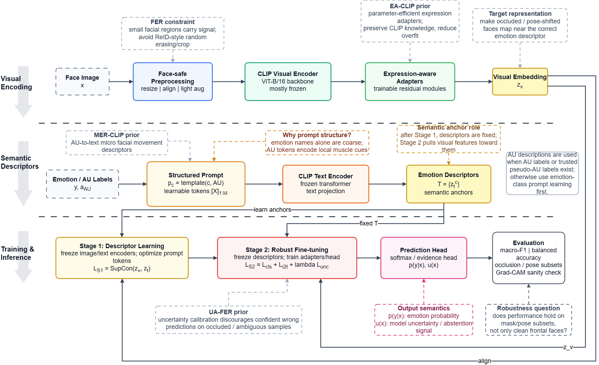
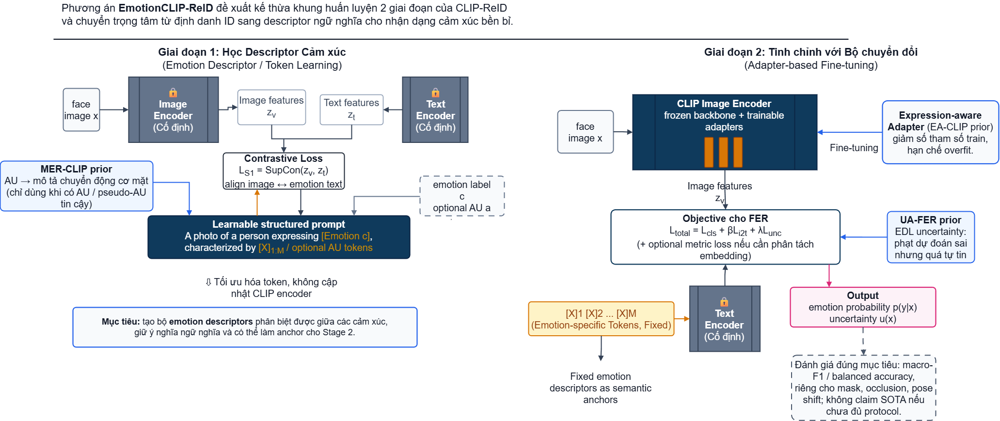

# Báo cáo đề xuất mô hình EmotionCLIP-ReID

**Bối cảnh:** tài liệu phục vụ buổi trình bày đề xuất mô hình với GVHD, theo vai trò học viên cao học ngành Khoa học máy tính.  
**Nguồn chính:** `docs/Tài liệu tham khảo/EmotionCLIP-ReID.pdf`, hai sơ đồ trong `docs/report/fig`, và các tài liệu nền CLIP-ReID, MER-CLIP, EA-CLIP, UA-FER.  
**Ngày lập:** 2026-05-10.

## 1. Tóm tắt luận điểm

Đề xuất EmotionCLIP-ReID nên được trình bày như một chuyển đổi có kiểm soát từ bài toán ReID sang bài toán Facial Expression Recognition (FER), không phải như một mô hình hoàn toàn mới từ đầu. Giá trị kế thừa lớn nhất từ CLIP-ReID là khung huấn luyện hai giai đoạn: trước hết học không gian mô tả văn bản, sau đó dùng mô tả đó làm neo ngữ nghĩa để tinh chỉnh nhánh ảnh.

Câu hỏi nghiên cứu trung tâm:

> Có thể thay các token mô tả theo ID trong CLIP-ReID bằng descriptor ngữ nghĩa theo cảm xúc/AU, rồi dùng chúng để huấn luyện một mô hình FER bền vững hơn với che khuất, lệch pose và mẫu mơ hồ hay không?

Câu trả lời khả thi ở mức đề xuất là **có**, nhưng cần tách rõ ba tầng: phần kế thừa trực tiếp, phần cần sửa vừa phải, và phần rủi ro cao cần thí nghiệm kiểm chứng.

## 2. Nền tảng khoa học cần kế thừa

### CLIP-ReID

CLIP-ReID xử lý nghịch lý của ReID: nhãn huấn luyện chỉ là chỉ số định danh, không có mô tả text tự nhiên. Mô hình dùng learnable text tokens theo từng ID để tạo mô tả mơ hồ, học chúng ở Stage 1 bằng contrastive loss, rồi cố định text side để fine-tune image encoder ở Stage 2. Đây là cơ chế đáng kế thừa vì FER cũng cần ánh xạ ảnh mặt vào một không gian ngữ nghĩa có thể diễn giải.

### MER-CLIP

MER-CLIP cho thấy AU/FACS có thể được chuyển thành mô tả văn bản về chuyển động cơ mặt. Với EmotionCLIP-ReID, AU không nên được xem là bắt buộc ở mọi dataset; nó nên là prior có điều kiện: dùng khi có nhãn AU hoặc pseudo-AU đủ tin cậy, nếu không thì bắt đầu bằng prompt theo lớp cảm xúc.

### EA-CLIP

EA-CLIP gợi ý adapter biểu cảm để tinh chỉnh CLIP hiệu quả hơn thay vì fine-tune toàn bộ backbone. Đây là hướng phù hợp với dữ liệu FER thường nhỏ và dễ overfit, nhưng cần kiểm soát vị trí chèn adapter, số tham số trainable và mức đóng băng backbone.

### UA-FER

UA-FER đặt vấn đề overconfidence trong FER bằng evidential/uncertainty learning. Với đề xuất hiện tại, uncertainty nên được xem là nhánh nâng cao: hữu ích cho mẫu che khuất/mơ hồ, nhưng không nên đưa vào như điều kiện bắt buộc của phiên bản đầu tiên.

## 3. Mô hình đề xuất ở mức tổng thể



Sơ đồ tổng thể có ba tầng logic:

- **Visual Encoding:** ảnh khuôn mặt đi qua tiền xử lý an toàn cho FER, CLIP visual encoder và expression-aware adapters để tạo embedding ảnh `z_v`.
- **Semantic Descriptors:** nhãn cảm xúc và AU tùy chọn được đưa vào structured prompt, qua CLIP text encoder cố định để tạo descriptor ngữ nghĩa `z_t`.
- **Training & Inference:** Stage 1 học descriptor; Stage 2 cố định descriptor làm semantic anchor, fine-tune adapter/head và đánh giá theo metric FER.

Điểm quan trọng khi bảo vệ với GVHD là không nói rằng mô hình chỉ "thêm adapter" vào CLIP. Cấu trúc thực sự là sự phối hợp giữa **prompt có cấu trúc**, **neo ngữ nghĩa**, **adapter biểu cảm** và **đánh giá độ bền**.

## 4. Cấu trúc huấn luyện hai giai đoạn



### Stage 1: Học descriptor cảm xúc

Stage 1 giữ cố định image encoder và text encoder. Thành phần được tối ưu là structured prompt/token mô tả cảm xúc. Mục tiêu không phải học ID như CLIP-ReID gốc, mà học các descriptor có khả năng phân biệt giữa các cảm xúc và vẫn giữ ý nghĩa ngôn ngữ.

Công thức khái quát:

```text
p_c = template(c, AU) + [X1]...[XM]
z_t = TextEncoder(p_c)
L_S1 = SupCon(z_v, z_t)
```

Nếu chưa có AU label hoặc pseudo-AU đáng tin, phiên bản khả thi đầu tiên nên dùng emotion-class prompt trước. AU nên được thêm vào như một ablation riêng.

### Stage 2: Fine-tune robust visual branch

Stage 2 cố định descriptor đã học, rồi huấn luyện adapter/head trên ảnh. Descriptor đóng vai trò semantic anchor để kéo visual embedding về vùng ngữ nghĩa đúng.

Công thức khái quát:

```text
L_total = L_cls + beta * L_i2t + lambda * L_unc
```

Trong đó `L_unc` chỉ nên bật ở phiên bản nâng cao sau khi baseline classification và image-text alignment đã ổn định.

## 5. Phân loại khả thi triển khai

| Mức khả thi | Thành phần | Lý do | Khuyến nghị |
|---|---|---|---|
| Khả dụng trực tiếp | CLIP backbone, PromptLearner/TextEncoder, train loop hai giai đoạn, contrastive/I2T alignment | Đã có trong nền tảng CLIP-ReID và phù hợp logic đề xuất | Dùng làm xương sống phiên bản v1 |
| Cần sửa vừa phải | FER dataloader, face-safe augmentation, emotion classification head, metric macro-F1/balanced accuracy | Khác miền dữ liệu và khác mục tiêu so với ReID | Làm trước adapter/uncertainty |
| Rủi ro cao | Adapter vào ViT block, EDL/uncertainty, AU-based prompt descriptor, Grad-CAM validation | Có lợi về khoa học nhưng dễ sai nếu thiếu protocol hoặc dữ liệu | Đưa vào sau khi có baseline mạnh |
| Chưa nên tuyên bố | MER-CLIP đầy đủ, EA-CLIP đầy đủ, UA-FER đầy đủ, claim SOTA | Cần tái hiện paper, dataset và benchmark chuẩn | Chỉ xem là nguồn cảm hứng/phương pháp luận |

## 6. Kế hoạch thí nghiệm đề xuất

| Mốc | Cấu hình | Mục tiêu kiểm chứng | Metric |
|---|---|---|---|
| E0 | CLIP visual encoder + linear FER head | baseline tối thiểu | accuracy, macro-F1 |
| E1 | Stage 1 emotion prompt learning | descriptor có giúp phân tách cảm xúc không | macro-F1, confusion matrix |
| E2 | Stage 2 với fixed descriptor + I2T loss | semantic anchor có cải thiện feature ảnh không | balanced accuracy, t-SNE/UMAP |
| E3 | Thêm expression-aware adapter | fine-tune ít tham số có giảm overfit không | macro-F1, validation gap |
| E4 | Thêm uncertainty/EDL | mô hình có bớt quá tự tin trên mẫu khó không | ECE, uncertainty-quality curve |
| E5 | AU prompt ablation | AU có thật sự thêm tín hiệu không | macro-F1 theo lớp, occlusion/pose subset |

## 7. Phản biện học thuật

Những điểm mạnh cần nhấn:

- Đề xuất có logic kế thừa rõ từ CLIP-ReID, không phải ghép cơ học nhiều paper.
- Việc chuyển từ ID token sang emotion descriptor làm tăng khả năng diễn giải.
- Adapter giúp giảm số tham số trainable, phù hợp dữ liệu FER nhỏ.
- Uncertainty trực tiếp trả lời vấn đề mẫu mơ hồ, che khuất và lệch pose.

Những điểm GVHD có thể chất vấn:

- Nếu không có AU label, structured prompt có còn khác gì prompt theo class name?
- Descriptor học được có thật sự giữ ngữ nghĩa hay chỉ trở thành embedding phân loại?
- Adapter đặt ở block nào của ViT, và vì sao?
- Uncertainty loss có cải thiện độ tin cậy hay chỉ làm huấn luyện phức tạp hơn?
- Protocol đánh giá nào đủ để chứng minh "bền vững" thay vì chỉ tốt trên ảnh sạch?

Cách trả lời nên là: triển khai theo từng nấc, không đưa tất cả module vào ngay từ đầu, và dùng ablation để chứng minh đóng góp của từng khối.

## 8. Kết luận đề xuất

EmotionCLIP-ReID khả thi như một hướng nghiên cứu nếu được đóng khung là **chuyển đổi CLIP-ReID sang FER bằng descriptor ngữ nghĩa cảm xúc**. Phiên bản nên làm trước là: FER dataloader + emotion prompt learning + fixed text descriptor + Stage 2 image/adapters + metric FER. AU và uncertainty nên là nhánh mở rộng có kiểm chứng, không phải điều kiện bắt buộc của phiên bản đầu.

Kết luận ngắn để trình bày với GVHD:

> Đề xuất này không nhằm tái hiện đầy đủ MER-CLIP, EA-CLIP hay UA-FER, mà dùng các ý tưởng đó như prior để thiết kế một kiến trúc hai giai đoạn kế thừa CLIP-ReID, có khả năng diễn giải và có lộ trình kiểm chứng rõ ràng cho FER bền vững.

## 9. Tài liệu tham khảo cục bộ

- `CLIP-ReID Exploiting Vision-Language Model for Im.pdf`
- `EmotionCLIP-ReID.pdf`
- `MER-CLIP AU-Guided Vision-Language.pdf`
- `Emotion-aware adaptation of CLIP model for.pdf`
- `UA-FER_ Uncertainty-aware representation learning for facial expression recognition.pdf`
