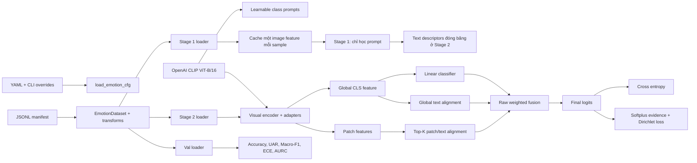
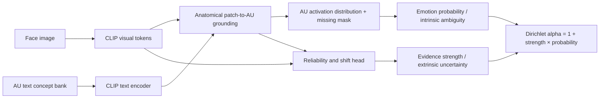

# Phân tích codebase, training logs và research gaps của EmotionCLIP-ReID

Ngày phân tích: 2026-07-14
Phạm vi: code, cấu hình, manifest, tests, training artifacts, hai notebook FER2013/RAF-DB và công bố khoa học đến thời điểm phân tích
Ràng buộc: chỉ phân tích và đề xuất; không chỉnh sửa source code
Mốc Git tham chiếu: main @ 5ceb8c0a9edd66f35726ff1702ec0d329c4911f0
Trạng thái kiểm thử: python -m pytest -q → 9 passed

Follow-up sửa protocol 2026-07-15: manifest thực tế đã được migrate; integration/unit test → 14 passed.

## 1. Kết luận điều hành

Hệ thống hiện tại là một baseline nghiên cứu có tín hiệu tốt, nhưng **chưa đủ điều kiện để dùng các con số hiện có làm kết quả generalization hoặc claim SOTA**. Lý do không nằm chủ yếu ở kiến trúc, mà ở protocol và provenance:

1. **Critical — test-selection leakage:** RAF-DB official test được đổi tên thành val; FER2013 publicTest và privateTest cùng bị gộp vào val. Tập này được đánh giá mỗi epoch và dùng để chọn best checkpoint.
2. **Critical — novelty collision:** tổ hợp CLIP + two-stage prompt learning + adapter + global/local image-text alignment + evidential uncertainty đã có độ chồng lấn chức năng cao với CLIP-ReID, CEPrompt, UA-FER, EA-CLIP và MPA-FER. Không nên định vị novelty chỉ bằng cách ghép các thành phần này.
3. **High — uncertainty chưa có ý nghĩa đáng tin:** uncertainty hiện phụ thuộc vào trị tuyệt đối/offset của fused logits. Log RAF cho thấy ở epoch đầu, accuracy 86.44%, confidence chỉ 18.01%, nhưng “uncertainty” lại rất thấp 3.47%. Đây là dấu hiệu evidence strength chưa biểu diễn epistemic uncertainty như mong muốn.
4. **High — overfit và hai tốc độ hội tụ:** RAF long đạt train accuracy 100% từ epoch 31. Macro-F1 tiếp tục tăng chậm đến epoch 150, trong khi phần lớn cải thiện sau đó nằm ở confidence/ECE. Kéo toàn bộ Stage 2 đến 200 epoch tốn khoảng 22 giờ nhưng chỉ tăng Macro-F1 1.115 điểm phần trăm so với run ngắn.
5. **High — artifact/run lineage không kín:** log không khóa Git SHA, dirty diff, manifest hash, package versions hoặc checkpoint checksum; notebook RAF còn trộn training curve của run 30 epoch với validation của run 200 epoch.
6. **High — AU data đã đi qua pipeline nhưng không được học:** au_labels và au_text được parse/collate, song không xuất hiện trong model/loss. Đây là gap rõ nhất để phát triển hướng mới, nhưng AU-guided vision-language alignment tự thân cũng không còn mới; phải bổ sung cơ chế giải quyết missing/noisy AU, grounding giải phẫu và uncertainty hợp lệ.

Đánh giá tổng quát:

- **Engineering baseline:** khá rõ ràng, modular, tests cơ bản chạy được.
- **Evidence chất lượng mô hình:** trung bình đối với các trajectory nội bộ; thấp đối với so sánh causal giữa run.
- **Evidence generalization/publication:** rất thấp trước khi sửa protocol.
- **Hướng có tiềm năng nhất:** tách học decision và calibration thành hai nhịp; sau đó nghiên cứu AU-grounded, ambiguity-aware và offset-invariant evidence thay vì tiếp tục tăng epoch.

## 2. Phạm vi và độ tin cậy của audit

Inventory đã phân tích gồm 141 file được chọn sau ignore:

| Nhóm                     | Số file |
| ------------------------- | -------: |
| Code/notebook             |       76 |
| Config và metric JSON    |       53 |
| Data artifact CSV         |        8 |
| Documentation             |        4 |
| Internal import relations |      100 |

Các ảnh dataset, checkpoint lớn, credential và cache không được đưa vào graph. Working tree tại thời điểm audit không sạch; hai notebook có thay đổi chưa commit. Vì vậy:

- Kết luận từ code là kết luận về **working tree hiện tại**.
- Kết luận từ notebook là kết luận về **output đã lưu trong notebook**, không mặc định là output của đúng commit hiện tại.
- Không có checkpoint cục bộ để tái chạy inference và xác minh bit-for-bit.
- FER long đang dở tại Stage 1 epoch 95/200 trong snapshot, nên không được dùng để kết luận hiệu năng.

Mức tin cậy dùng trong báo cáo:

- **Verified:** đọc trực tiếp từ source, manifest, CSV/JSON hoặc output notebook.
- **Inferred:** suy luận hợp lý từ nhiều bằng chứng nhưng chưa có thí nghiệm đối chứng.
- **Proposed:** hướng nghiên cứu/chỉnh sửa cần kiểm chứng.

## 3. Bản đồ kiến trúc hiện tại

README mô tả đúng rằng đây là **hai pipeline song song**, không phải một mô hình joint ReID–FER:

- Legacy ReID: train.py / train_clipreid.py → dataloader ReID → model ReID → triplet/ID losses → retrieval metrics.
- FER: train_emotionclip.py → emotion manifest → EmotionCLIPModel → classification/calibration metrics.
- FER branch khởi tạo vanilla CLIP ViT-B/16, không nạp checkpoint ReID mặc định.

Nếu mục tiêu luận văn là FER dựa trên kinh nghiệm từ CLIP-ReID, cấu trúc này hợp lý. Nếu mục tiêu là emotion-aware person ReID hoặc multi-task ReID–FER, phần coupling, dataset, loss và evaluation tương ứng hiện chưa tồn tại.

### 3.1 Phân tầng module

| Tầng                    | Thành phần chính                                                 | Vai trò                                             |
| ------------------------ | ------------------------------------------------------------------- | ---------------------------------------------------- |
| Entrypoint/orchestration | train_emotionclip.py, infer_emotionclip.py                          | Load config, seed, model, optimizer, train/infer     |
| Configuration            | config/emotion_defaults.py, configs/emotion/*.yml                   | Hyperparameters cho hai stage                        |
| Data                     | datasets/emotion_manifest.py, tools/convert_*.py                    | Chuẩn hóa 7 emotion, manifest, transforms, loaders |
| Representation           | model/clip/*, model/emotionclip_model.py                            | CLIP, prompt learner, adapters, global/local logits  |
| Objectives               | loss/emotion_losses.py                                              | CE, alignment CE, EDL CE/KL                          |
| Training/evaluation      | processor/processor_emotionclip.py                                  | Cache Stage 1, train Stage 2, checkpoint, validation |
| Metrics/report           | utils/fer_metrics.py, utils/notebook_metrics.py                     | FER metrics, ECE/AURC, notebook plots                |
| Verification             | tests/test_emotion_*.py                                             | Unit/smoke tests                                     |
| Legacy ReID              | datasets/make_dataloader*, model/make_model*, processor/processor_* | Pipeline ReID độc lập                             |

### 3.2 Điểm thiết kế tốt

- Prompt learner, adapter, loss và processor được tách module; source tương đối dễ ablate.
- Adapter up-projection được zero-init, giúp khởi đầu gần identity residual.
- Stage 1 cache visual features làm training prompt rất nhanh.
- Stage 2 giữ text descriptors cố định theo epoch, tránh gradient ngoài ý muốn vào prompt.
- Có Macro-F1, balanced accuracy, per-class F1, confusion matrix, ECE và risk-coverage AUC.
- Có smoke test CPU đi xuyên qua Stage 1/Stage 2; 9 tests hiện đều pass.

## 4. Gap matrix theo code

| ID  | Mức     | Gap đã xác minh                                         | Bằng chứng                                                                                        | Tác động                                                     | Đề xuất                                                   |
| --- | -------- | ---------------------------------------------------------- | --------------------------------------------------------------------------------------------------- | --------------------------------------------------------------- | ------------------------------------------------------------ |
| G01 | Critical | Official test được dùng làm val và chọn model       | RAF converter lines 209–236, 278–281; downloader lines 65–74, 101–106; processor lines 548–590 | Metric bị test-selection bias                                  | Tạo val từ official train; niêm phong official test       |
| G02 | Critical | Novelty overlap với các công bố gần                   | Kiến trúc hiện tại gần CLIP-ReID/CEPrompt/UA-FER/EA-CLIP                                       | Khó bảo vệ đóng góp                                       | Đổi research question, không chỉ thêm module            |
| G03 | High     | Uncertainty phụ thuộc absolute logit scale/offset        | model/emotionclip_model.py lines 281–292                                                           | U không identifiable; calibration dễ bị hiểu sai            | Tách probability shape và evidence strength                |
| G04 | High     | Fusion weights không bị ràng buộc                      | lines 199–201, 286–288                                                                            | Có thể âm; branch scale không đồng nhất                  | Softmax/simplex gate, branch temperature, log gate           |
| G05 | High     | Stage 2 không phải adapter-only PETL                     | set_train_stage unfreeze toàn bộ last block, lines 219–225                                       | Tăng overfit/compute; claim PETL không chính xác            | Ablate last_blocks=0/1/2 và báo trainable params           |
| G06 | High     | Local Top-K không có anatomy/landmark/AU grounding       | lines 254–257                                                                                      | Học shortcut nền/tóc; gradient chỉ qua patch được chọn  | Ground patch bằng AU/landmark và audit localization        |
| G07 | High     | AU metadata không được model/loss dùng                | EmotionSample/collate lines 45–55, 245–273; không có consumer                                   | Mất tín hiệu giải phẫu, gap giữa schema và method        | AU auxiliary/masked loss + AU text concept bank              |
| G08 | High     | Chỉ có train/val loader, không có sealed test loader   | emotion_manifest.py lines 319–343                                                                  | Protocol test không thể thực hiện đúng                    | Loader/calibration/test tách biệt                          |
| G09 | High     | Split leakage check chỉ dựa video_id/subject_id có sẵn | lines 172–183                                                                                      | FER/RAF thiếu ID nên duplicate leakage không bị phát hiện | SHA/perceptual hash và identity-cluster audit               |
| G10 | High     | Artifact bị overwrite/trộn khi tái dùng output dir     | train config xóa CSV cũ; metrics_epoch_N và best tên cố định                                 | Không tái tạo run atomic                                     | Mỗi run một immutable run_id directory                     |
| G11 | High     | Checkpoint không đủ để resume/reproduce               | payload chỉ model/epoch/stage/metrics                                                              | Không khôi phục optimizer, scheduler, RNG                    | Lưu optimizer/scheduler/scaler/RNG/config/hash              |
| G12 | Medium   | Stage 1 dùng đúng một stochastic view đã cache       | processor lines 276–301; train transform có flip/jitter                                           | Prompt overfit vào một view cố định                        | Deterministic multi-view cache hoặc refresh có kiểm soát |
| G13 | Medium   | Class imbalance chưa được xử lý                      | shuffle DataLoader, không sampler/weight                                                           | Worst-class thấp; accuracy lạc quan                           | So sánh balanced sampler/logit adjustment/deferred reweight |
| G14 | Medium   | Không AMP/grad clipping trong emotion processor           | AMP chỉ có trong legacy ReID processor                                                            | Stage 2 chậm, thiếu stability telemetry                       | AMP benchmark, grad norm/clip ablation                       |
| G15 | Medium   | CHECKPOINT_PERIOD không được processor dùng           | config có field nhưng save last mỗi epoch                                                        | Config và behavior lệch nhau                                  | Định nghĩa lại artifact policy                           |
| G16 | Medium   | Metric calibration còn hẹp                               | ECE 15 equal-width bins; raw AURC                                                                   | Không đủ đánh giá reliability/OOD                         | NLL, Brier, adaptive/classwise ECE, E-AURC, OOD              |
| G17 | Medium   | Single seed và CUDA determinism chưa khóa               | seed=1234; không deterministic algorithms                                                          | Không có variance/significance                                | 3–5 seeds, mean±CI, paired bootstrap/McNemar               |
| G18 | Medium   | Environment không pin version                             | environment_emotionclip_cuda.yml                                                                    | Khó reproduce giữa T4/local                                   | Exact lock + CUDA/cuDNN/PyTorch metadata                     |
| G19 | Medium   | Notebook summary có source-selection bug                  | RAF plot dùng CSV short; latest payload được ưu tiên hơn best                                | Biểu đồ/per-class F1 có thể gắn sai run                   | Run-aware parser và explicit best/latest labels             |
| G20 | Medium   | Tests chưa bao phủ protocol/reliability                  | 9 tests tập trung shape/smoke/basic metric                                                         | Regression quan trọng không bị chặn                         | Test split sealing, trainable mask, uncertainty invariants   |

## 5. Phân tích dữ liệu và protocol

### 5.1 Split thực tế

> **Cập nhật triển khai 2026-07-15:** gap critical này đã được sửa trong converter, dataloader và training flow.
> Bảng dưới đây được giữ lại như baseline audit của các run cũ; các metric cũ vẫn không đủ điều kiện dùng để
> claim SOTA.

| Dataset    |                 Train |                               Val hiện tại | Test kín | Vấn đề                          |
| ---------- | --------------------: | -------------------------------------------: | --------: | ---------------------------------- |
| FER2013 HF |                28,709 | 7,178 = 3,589 publicTest + 3,589 privateTest |         0 | privateTest bị dùng mỗi epoch   |
| RAF-DB     | 12,271 official train |                          3,068 official test |         0 | official test bị đổi thành val |

Tại mốc audit, README còn hướng dẫn FER bằng `--test-as val`. Follow-up 2026-07-15 đã bỏ mapping nguy hiểm này: publicTest làm val, privateTest làm test.

Đối với RAF-DB:

1. Tạo split train/val cố định, stratified từ official train.
2. Lưu index và hash của split như artifact versioned.
3. Chọn epoch/hyperparameter chỉ trên val.
4. Chạy official test sau khi khóa model và analysis plan.
5. Nếu tạo nhiều seed, không thay thiết kế dựa trên kết quả official test giữa các seed.

Protocol mới đã triển khai:

| Dataset/chế độ                        |                         Train |                            Val/model selection |          Test cuối | Trạng thái                           |
| ---------------------------------------- | ----------------------------: | ---------------------------------------------: | ------------------: | -------------------------------------- |
| FER2013                                  |               28,709 Training |                               3,589 PublicTest |   3,589 PrivateTest | privateTest không đi vào epoch loop |
| RAF-DB development (`--val-ratio 0.2`) | stratified 80% official train | stratified 20% official train, seed cố định | 3,068 official test | dùng để chọn hyperparameter/epoch  |
| RAF-DB final (`--val-ratio 0`)         |    đủ 12,271 official train |   không có; epoch đã khóa từ development | 3,068 official test | parity về số mẫu train khi so SOTA  |

`TEST.EVALUATE_AFTER_TRAIN` mặc định là `false`; test chỉ được mở explicit sau khi khóa quyết định. Manifest RAF
ghi `official_split`, `validation_ratio`, `split_seed` và `split_protocol`. Dataloader trả `val_loader` và
`test_loader` riêng, còn hàm Stage 2 chỉ nhận validation loader. Test cuối sinh artifact riêng
`test_metrics.json` với `evaluation_split`, `selection_split` và checkpoint được dùng.

Lựa chọn 20% development từ official train có đối chiếu với [Dual-EmoNet (2026)](https://ietresearch.onlinelibrary.wiley.com/doi/10.1049/ipr2.70301),
trong đó RAF-DB dùng standard train/test và giữ 20% training cho validation. Quy mô benchmark RAF-DB
12,271/3,068 cũng được báo cáo trong [DUAL (2025)](https://onlinelibrary.wiley.com/doi/10.1155/int/7401168).

### 5.2 Imbalance

| Dataset/split        | Lớp lớn nhất | Lớp nhỏ nhất | Tỷ lệ |
| -------------------- | --------------: | --------------: | ------: |
| FER train            | happiness 7,215 |     disgust 436 | 16.55× |
| FER current val      | happiness 1,774 |     disgust 111 | 15.98× |
| RAF train            | happiness 4,772 |        fear 281 | 16.98× |
| RAF current val/test | happiness 1,185 |         fear 74 | 16.01× |

Khoảng cách accuracy và balanced accuracy tại best Macro-F1 là 2.27 pp trên FER-short, 7.33 pp trên RAF-short và 8.03 pp trên RAF-long. Vì vậy accuracy không nên là primary endpoint.

### 5.3 Leakage chưa được phát hiện

validate_split_leakage chỉ tìm video_id hoặc subject_id xuất hiện ở nhiều split. Hai manifest chính không có các field này. Nên bổ sung audit ngoài model:

- Exact hash và perceptual hash để tìm duplicate/near-duplicate.
- Face-embedding clustering chỉ dùng như diagnostic để phát hiện cùng identity ở nhiều split; cần kiểm tra thủ công vì pseudo-ID có lỗi và liên quan dữ liệu sinh trắc.
- Báo duplicate rate, identity-cluster overlap và source provenance.

## 6. Inventory và kết quả training

Có ba run hoàn chỉnh và một run dài đang dở:

| Run       | Trạng thái                    | Cấu hình thực tế                | Dữ liệu đánh giá     | Wall-time gần đúng |
| --------- | ------------------------------- | ----------------------------------- | ------------------------- | --------------------: |
| FER-short | Hoàn tất 2026-07-02/03        | Stage 1: 20×64; Stage 2: 30×32    | 7,178 public+private test |                 7h51m |
| RAF-short | Hoàn tất 2026-07-03           | Stage 1: 20×128; Stage 2: 30×64   | 3,068 official test       |                 3h20m |
| RAF-long  | Hoàn tất 2026-07-07/08        | Stage 1: 200×128; Stage 2: 200×64 | cùng official test; T4   |                22h24m |
| FER-long  | Chưa hoàn tất trong snapshot | Stage 1 mới tới epoch 95/200      | chưa có validation      |     chưa xác định |

### 6.1 FER-short

| Mốc                    | Accuracy | Balanced acc |         Macro-F1 |              ECE |
| ----------------------- | -------: | -----------: | ---------------: | ---------------: |
| Best accuracy, epoch 8  |   0.7115 |       0.6741 |           0.6833 |           0.4405 |
| Best Macro-F1, epoch 24 |   0.7059 |       0.6832 | **0.6864** |           0.3746 |
| Lowest ECE, epoch 29    |   0.7034 |       0.6787 |           0.6828 | **0.3682** |
| Last, epoch 30          |   0.7048 |       0.6797 |           0.6837 |           0.3696 |

Điểm nghẽn chính theo confusion matrix:

- fear F1 0.5279; nhầm nhiều sang sadness và anger.
- sadness F1 0.5983; nhầm nhiều sang neutral và fear.
- happiness F1 0.8888, cao hơn rõ rệt và có support lớn nhất.

Accuracy bão hòa khá sớm; từ epoch 13–30 mean accuracy chỉ khoảng 0.7043. ECE vẫn giảm khi accuracy gần như đứng yên, gợi ý decision learning và evidence scaling có hai tốc độ khác nhau.

### 6.2 RAF-short

| Mốc                      |         Accuracy |     Balanced acc |         Macro-F1 |              ECE |             AURC |
| ------------------------- | ---------------: | ---------------: | ---------------: | ---------------: | ---------------: |
| Best balanced, epoch 7    |           0.8748 | **0.8108** |           0.8067 |           0.4884 |           0.0882 |
| Best accuracy, epoch 14   | **0.8794** |           0.8000 |           0.8104 |           0.4320 |           0.0582 |
| Best Macro-F1, epoch 28   |           0.8778 |           0.8045 | **0.8116** |           0.3910 | **0.0509** |
| Last/lowest ECE, epoch 30 |           0.8761 |           0.8013 |           0.8088 | **0.3892** |           0.0517 |

Train accuracy ở epoch 28 là 0.9935; generalization gap theo accuracy khoảng 11.57 pp. Stage 2 loss giảm 0.8250 → 0.1056 nhưng accuracy đánh giá chỉ tăng 0.8667 → 0.8761.

### 6.3 RAF-long

| Mốc                     |         Accuracy |     Balanced acc |          Macro-F1 |              ECE |             AURC |
| ------------------------ | ---------------: | ---------------: | ----------------: | ---------------: | ---------------: |
| Epoch 30                 |           0.8781 |           0.7973 |            0.8050 |           0.2998 |           0.0358 |
| Best balanced, epoch 82  |           0.8875 | **0.8128** |            0.8199 |           0.1636 |           0.0241 |
| Best accuracy, epoch 105 | **0.8902** |           0.8079 |            0.8223 |           0.1158 |           0.0244 |
| Best Macro-F1, epoch 150 |           0.8879 |           0.8075 | **0.82274** |          0.07352 |          0.02406 |
| Lowest AURC, epoch 153   |           0.8885 |           0.8084 |            0.8211 |           0.0748 | **0.0234** |
| Lowest ECE, epoch 188    |           0.8869 |           0.8032 |            0.8191 | **0.0624** |           0.0241 |
| Last, epoch 200          |          0.88755 |          0.80262 |           0.81849 |          0.06511 |          0.02401 |

So với RAF-short tại best Macro-F1:

- Accuracy: +1.010 pp.
- Macro-F1: +1.115 pp.
- ECE: giảm 31.746 pp.
- F1 fear: 0.7133 → 0.6667, giảm 4.66 pp.
- Train accuracy đạt 1.0000 từ epoch 31; gap cuối khoảng 11.25 pp.

Không thể kết luận causal rằng “nhiều epoch tốt hơn” vì run chỉ có một seed, revision/data hash không khóa và cả hai stage cùng thay đổi. Đặc biệt tại epoch 30, RAF-long chưa tốt hơn RAF-short về Macro-F1, dù ECE tốt hơn đáng kể.

### 6.4 Artifact và logging anomalies

- Notebook RAF-long dùng validation trajectory 200 epoch nhưng training plot lại lấy outputs/report_w4/rafdb_training_history_extracted.csv của run 30 epoch.
- Sau dòng “best Macro-F1 epoch 150”, per-class F1 được lấy từ latest metrics epoch 200.
- FER notebook là một snapshot partial/rerun, còn cell/output cũ; không nên xem toàn notebook như một run atomic.
- Workspace không có checkpoint .pth/.pt/.ckpt; checkpoint chỉ tồn tại trên Jupyter từ xa theo output.
- FER-short từng tạo khoảng 51 checkpoint cỡ 480 MiB, xấp xỉ 24.5 GiB; behavior này không khớp source hiện tại chỉ ghi last/best, cho thấy code–artifact revision drift.
- LR 5e-6 bị format thành 0.0000 trong một số log.
- Không có validation loss, NLL, Brier, classwise ECE, peak VRAM, throughput chuẩn, gradient norm hoặc per-sample prediction artifact đầy đủ.

## 7. Phân tích sâu nhánh uncertainty

### 7.1 Công thức hiện tại và vấn đề offset

Code tạo:

- evidence_k = softplus(z_k)
- alpha_k = evidence_k + 1
- probability_k = alpha_k / tổng alpha
- uncertainty u = K / tổng alpha, với K = 7

Vấn đề: nếu cộng cùng một hằng số c vào tất cả logits:

- softmax(z + c) = softmax(z), nên cross entropy và quyết định lớp không đổi;
- nhưng softplus(z_k + c) thay đổi, nên tổng alpha và u thay đổi.

Do final logits là tổng của linear-classifier logits, global cosine logits và local cosine logits với raw trainable weights, origin/scale của z không được cố định. Vì vậy uncertainty hiện phụ thuộc vào một “gauge” tùy ý của logits, không chỉ vào độ tin cậy nội tại của sample.

Đây là gap có bằng chứng trực tiếp từ RAF-long:

| Epoch | Accuracy | Avg confidence | Avg uncertainty | Suy ra Dirichlet strength 7/u | Mean evidence/class |
| ----: | -------: | -------------: | --------------: | ----------------------------: | ------------------: |
|     1 |   0.8644 |         0.1801 |          0.0347 |                        201.73 |               27.82 |
|    10 |   0.8729 |         0.4392 |          0.5942 |                         11.78 |                0.68 |
|   150 |   0.8879 |         0.8146 |          0.1762 |                         39.73 |                4.68 |
|   200 |   0.8876 |         0.8256 |          0.1596 |                         43.86 |                5.27 |

Epoch 1 có phân phối gần đều (confidence 0.18 so với uniform 1/7 ≈ 0.143), nhưng evidence trung bình lại rất lớn. Từ epoch 4 sang 5, uncertainty còn nhảy 0.0641 → 0.5021 ở RAF-long; pattern tương tự lặp lại ở RAF-short. Điều này phù hợp với phase transition do EDL annealing=3 và absolute evidence scale, hơn là thay đổi đột ngột trong accuracy.

### 7.2 Diễn giải ECE đúng với log

Calibration error hiện chủ yếu là **underconfidence**, không phải overconfidence:

- RAF-short best: accuracy 0.8778, avg confidence 0.4868, ECE 0.3910.
- RAF-long best: accuracy 0.8879, avg confidence 0.8146, ECE 0.0735.

ECE giảm phần lớn vì confidence tăng dần về gần accuracy. Điều đó không tự chứng minh model đã học epistemic uncertainty đúng. AURC giảm cho thấy khả năng ranking sample có cải thiện, nhưng raw AURC bị ảnh hưởng bởi base error rate.

E-AURC ước tính:

| Run       | Raw AURC | Oracle AURC |  E-AURC |
| --------- | -------: | ----------: | ------: |
| FER-short |  0.22545 |     0.04825 | 0.17721 |
| RAF-short |  0.05090 |     0.00779 | 0.04311 |
| RAF-long  |  0.02406 |     0.00654 | 0.01752 |

### 7.3 Đề xuất uncertainty có thể kiểm chứng

Thiết kế nên tách:

1. **Probability shape:** p = softmax(z / temperature), biểu diễn cạnh tranh giữa các lớp.
2. **Evidence strength:** s = softplus(g(h)), sinh từ feature/reliability head riêng.
3. **Dirichlet:** alpha = 1 + s × p.

Khi đó common offset của z không làm đổi p; s không còn được suy trực tiếp từ trị tuyệt đối của classification logits. Reliability head cần được huấn luyện/hiệu chỉnh bằng proper scoring rule, correctness/augmentation consistency và các tập shifted/OOD, không chỉ bằng in-domain CE.

Baseline bắt buộc:

- Softmax CE không EDL.
- Temperature scaling trên calibration split.
- Energy score.
- MC dropout hoặc deep ensemble nhỏ.
- Current EDL.
- Proposed decoupled strength head.

Theo [NeurIPS 2024 — Are Uncertainty Quantification Capabilities of Evidential Deep Learning a Mirage?](https://proceedings.neurips.cc/paper_files/paper/2024/hash/c3177be226ee12e34d6ba3b5e6fe6a5b-Abstract-Conference.html), EDL có thể cho downstream performance tốt nhưng epistemic uncertainty vẫn kém tin cậy và thường gần cách diễn giải energy-based OOD hơn. Vì vậy tên metric “uncertainty” phải đi kèm validation cụ thể, không được suy ra chỉ từ ECE. Temperature scaling là baseline đơn giản nhưng mạnh theo [Guo et al., ICML 2017](https://proceedings.mlr.press/v70/guo17a.html).

## 8. Đối chiếu công bố khoa học và novelty

### 8.1 Bản đồ overlap

| Công bố                                                                                                                                                                       | Đóng góp chính liên quan                                                                                        | Overlap với code hiện tại                               | Khoảng trống còn lại                                                       |
| ------------------------------------------------------------------------------------------------------------------------------------------------------------------------------- | -------------------------------------------------------------------------------------------------------------------- | ---------------------------------------------------------- | ------------------------------------------------------------------------------ |
| [CLIP-ReID, AAAI 2023](https://ojs.aaai.org/index.php/AAAI/article/view/25225)                                                                                                   | Two-stage: học prompt/ID text rồi dùng text constraint để fine-tune visual                                      | Two-stage scaffold và class-specific prompt               | FER không dùng ReID identity text hoặc retrieval objective                  |
| [CEPrompt, TCSVT 2024](https://doi.org/10.1109/TCSVT.2024.3424777)                                                                                                               | Emotion-guided visual adapter, cross-modal prompt tuning, distillation                                               | Prompt + visual adapter                                    | Code thiếu CAT/distillation; thêm adapter không còn là novelty            |
| [UA-FER, Neurocomputing 2025](https://www.sciencedirect.com/science/article/pii/S0925231224020320)                                                                               | CLIP, global/local feature decoupling, image-text affinity, EDL uncertainty calibration                              | Overlap chức năng rất cao với global/local Top-K + EDL | Cần so sánh/ablation trực tiếp; không claim tổ hợp này là mới        |
| [EA-CLIP, AI Review 2026](https://link.springer.com/article/10.1007/s10462-025-11468-4)                                                                                          | Expression-aware adapters + instance-enhanced text classifier                                                        | Adapter và CLIP FER                                       | Code thiếu instance-conditioned classifier; adapter alone đã crowded        |
| [MPA-FER, ICCV 2025](https://openaccess.thecvf.com/content/ICCV2025/html/Ma_Multimodal_Prompt_Alignment_for_Facial_Expression_Recognition_ICCV_2025_paper.html)                  | LLM hard prompts, visual/text soft prompts, prototype-guided alignment, global-local alignment, frozen image encoder | Prompt và global/local alignment                          | Current unfreezes full last block, thiếu prototype/hard prompt/generalization |
| [Exp-CLIP, WACV 2025](https://openaccess.thecvf.com/content/WACV2025/html/Zhao_Enhancing_Zero-Shot_Facial_Expression_Recognition_by_LLM_Knowledge_Transfer_WACV_2025_paper.html) | LLM knowledge transfer vào facial-action space; zero-shot trên bảy dataset                                        | Dùng CLIP semantic space                                  | Current là supervised 7-class prompt, chưa có facial-action space           |
| [Generalizable FER, ECCV 2024](https://eccv.ecva.net/virtual/2024/poster/718)                                                                                                    | Giữ CLIP cố định, mask expression features, cross-dataset zero-shot                                              | Mục tiêu giữ generalization                             | Current không có cross-dataset protocol và unfreeze last block              |
| [AUFormer, ECCV 2024](https://eccv.ecva.net/virtual/2024/poster/1068)                                                                                                            | AU-specific PETL experts và asymmetric loss                                                                         | Adapter/PETL idea                                          | Gợi ý cách dùng AU; code hiện không học AU                              |
| [Norface, ECCV 2024](https://eccv.ecva.net/virtual/2024/poster/1454)                                                                                                             | Identity normalization cho FER/AU và cross-dataset                                                                  | Chưa có                                                  | Identity là nuisance chưa được đo hoặc khử                             |
| [MER-CLIP, 2025 preprint](https://arxiv.org/abs/2505.05937)                                                                                                                      | Chuyển AU thành mô tả text để align visual dynamics                                                            | Gần hướng AU-text đề xuất                            | AU-text alignment tự thân không đủ mới                                   |
| [Rethinking ambiguity, Pattern Recognition 2026](https://www.sciencedirect.com/science/article/pii/S0031320326008757)                                                            | Tách intrinsic và extrinsic ambiguity; positive-negative learning                                                  | Current gom mọi uncertainty vào một scalar              | Cơ sở tốt để tách class ambiguity và reliability                        |
| [TTA for FER, ICASSP 2026](https://www.cmsworkshops.com/ICASSP2026/view_paper.php?PaperNum=10233&bare=1)                                                                         | TTA hiệu quả phụ thuộc loại/khoảng cách shift; cross-dataset gain tới 11.34%                                 | Current không adaptation                                  | Cần shift diagnosis trước khi chọn TTA                                     |

MPA-FER báo cáo 93.74% trên RAF-DB trong protocol của bài, còn current best accuracy là khoảng 88.79% trên tập official test đã được dùng để model selection. Hai con số **không được so trực tiếp** do khác preprocessing, training protocol, backbone details và test leakage. Chúng chỉ cho thấy current chưa có bằng chứng để claim cạnh tranh SOTA.

### 8.2 Kết luận novelty

Không nên dùng một trong các claim sau:

- “Lần đầu dùng CLIP cho FER.”
- “Lần đầu dùng prompt/adapters cho FER.”
- “Lần đầu kết hợp global-local với EDL.”
- “Lần đầu dùng AU text alignment.”

Một claim có khả năng bảo vệ hơn phải giải quyết đồng thời một vấn đề chưa được xử lý sạch:

- phân biệt intrinsic class ambiguity với extrinsic/shift uncertainty;
- evidence strength bất biến với common-logit offset;
- AU grounding vẫn hoạt động khi AU label thiếu/noisy;
- xác minh giải phẫu của local patches;
- identity invariance và cross-domain generalization;
- hoặc two-timescale training giảm compute đáng kể mà giữ discrimination và reliability.

## 9. Research question đề xuất

### 9.1 Hướng lõi khuyến nghị

**Anatomy-grounded, ambiguity-aware EmotionCLIP với offset-invariant evidence.**

Giả thuyết:

1. Emotion text prototype đơn thuần không đủ phân biệt fear/surprise hoặc sadness/neutral.
2. AU concept bank tạo semantic bottleneck có thể kiểm tra được giữa facial patch và emotion label.
3. Intrinsic ambiguity nên nằm trong probability distribution giữa các lớp tương thích.
4. Extrinsic uncertainty nên đến từ strength/reliability head dựa trên visual–AU consistency, occlusion và domain shift, không đến từ common offset của class logits.

Khung khái niệm:

Đây là **research hypothesis**, chưa phải novelty đã được xác nhận. Trước khi chọn làm contribution chính, cần systematic search thêm quanh MER-CLIP, VL-FAU, AUFormer, ambiguity learning và decoupled evidential parameterization.

### 9.2 Hướng thực dụng, rủi ro thấp hơn

**Two-timescale optimization:**

- Phase A học decision boundary bằng CE/alignment đến khi Macro-F1/UAR bão hòa.
- Đóng băng representation/classifier.
- Phase B chỉ học calibration/reliability head trên calibration split, có early stop theo NLL/E-AURC.

Hướng này xuất phát trực tiếp từ log: discrimination hội tụ sớm hơn evidence scale. Mục tiêu là đạt reliability gần run 200 epoch với chi phí nhỏ hơn đáng kể. Tự nó có thể chưa đủ novelty cho top venue, nhưng là nền thực nghiệm cần thiết.

### 9.3 Góc nhìn mới cần cân nhắc

1. **Scope fork — FER hay joint ReID–FER:** nếu chỉ FER, nên định vị repo là parallel extension và xem identity là nuisance. Nếu joint, cần pid-aware data, retrieval metrics và multi-task objective; không được suy từ tên repo.
2. **Identity leakage probe:** đo khả năng linear probe nhận identity từ expression feature. Nếu cao, dùng feature orthogonalization/HSIC hoặc adversarial nuisance removal; tránh normalization sinh ảnh nếu nó tạo artifact.
3. **Shift-aware inference router:** ước lượng source–target distance/noise rồi chọn entropy minimization, prototype adjustment hoặc feature alignment thay vì một TTA cố định, phù hợp kết quả ICASSP 2026.
4. **Local-patch faithfulness:** đánh giá patch được chọn có trùng AU/landmark vùng mắt-miệng hay không; báo pointing-game/IoU/perturbation test. Nếu không, Top-K similarity chỉ là attention-looking explanation.
5. **Pareto checkpointing:** tối ưu Macro-F1, worst-class F1, E-AURC và compute thay vì một scalar duy nhất.

## 10. Roadmap ưu tiên

### P0 — Chặn rò rỉ và khóa provenance

Điều kiện hoàn thành:

- RAF official test không xuất hiện trong loop validation.
- FER publicTest=val, privateTest=test.
- Có train/val/calibration/test tách biệt hoặc nested split phù hợp.
- Mỗi run lưu Git SHA, dirty flag/diff hash, resolved config, manifest/split hashes, dependency versions, seed và hardware.
- Mỗi run có thư mục immutable; notebook chỉ đọc artifact theo run_id.
- Không dùng test để chọn checkpoint, temperature hoặc threshold.

Không nên tối ưu kiến trúc trước khi P0 hoàn thành, vì mọi quyết định hiện tại có nguy cơ tiếp tục overfit official test.

### P1 — Thiết lập baseline ladder và compute budget

Chạy cùng protocol, cùng seeds:

| ID  | Variant                        | Mục đích                        |
| --- | ------------------------------ | ---------------------------------- |
| B0  | Zero-shot CLIP + manual prompt | Mốc semantic không train         |
| B1  | Frozen CLIP + linear probe     | Mốc supervised tối giản         |
| B2  | Stage 1 prompt only            | Lợi ích prompt                   |
| B3  | B2 + global alignment          | Lợi ích cross-modal global       |
| B4  | B3 + local Top-K               | Lợi ích local                    |
| B5  | B4 + adapters, last_blocks=0   | PETL thật                         |
| B6  | B5 + last block 1              | Giá của partial full fine-tuning |
| B7  | B6 + raw/constrained fusion    | Lợi ích fusion                   |
| B8  | B7 + current EDL               | Lợi ích/hại của EDL            |
| B9  | B7 + temperature scaling       | Calibration baseline               |
| B10 | B7 + decoupled evidence head   | Proposed uncertainty               |

Báo trainable parameters, GFLOPs, peak VRAM, images/s và wall-time cho từng variant.

### P2 — Tối ưu schedule có causal evidence

Không cần chạy toàn bộ lưới 4×5 ngay lập tức. Dùng successive halving:

1. Stage 1: 20, 50, 100, 200; giữ Stage 2 ngắn và test trên val hợp lệ.
2. Chọn 1–2 Stage 1 budgets trên Pareto Macro-F1/compute.
3. Stage 2: 30, 60, 100, 150; early stop.
4. So sánh annealing 3, 10, 20, 50 chỉ trên các schedule còn lại.
5. Tách calibration-only phase.

Log hiện gợi ý stop khoảng 100–150 epoch cho RAF nếu mục tiêu Macro-F1; epoch 150→200 làm Macro-F1 giảm 0.42 pp dù ECE còn giảm.

### P3 — Imbalance và class conflict

So sánh tối thiểu:

- uniform shuffle baseline;
- class-balanced sampler;
- logit adjustment;
- deferred reweighting;
- class-balanced focal/asymmetric loss.

Primary: Macro-F1 và UAR. Safety metric: worst-class F1. Audit riêng:

- FER: fear/sadness/neutral/anger.
- RAF: disgust và fear/surprise.

Không chọn một phương pháp chỉ vì accuracy tăng nếu worst-class hoặc calibration lớp hiếm giảm.

### P4 — Core novelty

Thêm từng block theo thứ tự:

1. AU concept bank và missing-AU mask.
2. Patch-to-AU anatomical grounding.
3. Emotion-from-AU composition/auxiliary supervision.
4. Decoupled reliability strength.
5. Intrinsic/extrinsic ambiguity objectives.

Mỗi block phải có ablation và failure analysis. Không ghép cả năm rồi chỉ báo một hàng “ours”.

### P5 — Robustness và deployment

- Cross-dataset: RAF→FERPlus/AffectNet/ExpW và chiều ngược phù hợp label mapping.
- Corruption: blur, low-resolution, occlusion, pose, illumination.
- OOD: non-face, neutral/compound/unknown expressions và dataset ngoài nguồn.
- TTA chỉ sau khi có frozen source model và shift taxonomy.
- Báo risk@50/80/90% coverage, OOD AUROC/AUPR/FPR95 và latency.

## 11. Thiết kế thí nghiệm và tiêu chí quyết định

### 11.1 Endpoints

| Nhóm                  | Metric                                                   |
| ---------------------- | -------------------------------------------------------- |
| Primary discrimination | Macro-F1, balanced accuracy/UAR                          |
| Class safety           | Worst-class F1, per-class recall/precision               |
| Calibration            | NLL, Brier, ECE equal-width, adaptive ECE, classwise ECE |
| Selective prediction   | AURC, E-AURC, risk@coverage                              |
| OOD/error detection    | AUROC, AUPR-error, FPR95                                 |
| Generalization         | Cross-dataset Macro-F1/UAR                               |
| Efficiency             | Trainable params, GFLOPs, VRAM, throughput, wall-time    |

### 11.2 Statistics

- Ít nhất 3 seeds để sàng lọc, 5 seeds cho bảng chính nếu compute cho phép.
- Mean ± standard deviation và 95% CI.
- Paired bootstrap trên per-sample predictions cho Macro-F1/ECE.
- McNemar cho paired accuracy errors.
- Công bố trước primary metric và checkpoint selection rule.
- Wilson 95% CI riêng sampling uncertainty của RAF accuracy đã khoảng ±1.1 pp, gần mức gain short→long 1.0 pp; seed variance và selection bias còn chưa được tính.

### 11.3 Go/no-go đề xuất

Đây là threshold do dự án đặt trước, không phải chuẩn chung của cộng đồng:

- Một model change chỉ đi tiếp nếu gain Macro-F1/UAR ổn định qua seeds và không làm worst-class F1 giảm có ý nghĩa.
- Một uncertainty change chỉ đi tiếp nếu NLL/Brier và E-AURC cùng cải thiện trên val lẫn shifted/OOD; ECE đơn lẻ không đủ.
- AU module chỉ được xem là có giá trị nếu tăng minority/occlusion performance và grounding faithfulness, không chỉ overall accuracy.
- Last-block unfreezing chỉ giữ lại nếu gain bù được trainable params/compute và không làm cross-domain giảm.
- TTA chỉ dùng khi router/validation chứng minh đúng loại shift; không tune trên target test labels.

## 12. Kế hoạch chỉnh sửa theo file

Phần này là kế hoạch, **chưa được triển khai**.

| File/module                             | Chỉnh sửa dự kiến                                                                                        | Test cần thêm                                             |
| --------------------------------------- | ------------------------------------------------------------------------------------------------------------ | ----------------------------------------------------------- |
| tools/convert_rafdb_to_emotion_jsonl.py | Không mặc định map official test→val; sinh/freeze internal val từ train hoặc yêu cầu split artifact | official test không có trong val                          |
| tools/download_hf_emotion_dataset.py    | publicTest→val, privateTest→test mặc định cho FER2013                                                   | split counts/hash chính xác                               |
| datasets/emotion_manifest.py            | train/val/calibration/test loaders; duplicate/near-duplicate audit; group-aware split                        | leakage bằng hash/ID, sealed test                          |
| config/emotion_defaults.py + YAML       | seeds, calibration split, early stop, AMP, grad clip, artifact policy, uncertainty mode                      | config validation                                           |
| model/emotionclip_model.py              | constrained fusion; last_blocks ablation; AU grounding; decoupled strength head                              | trainable parameter mask, offset invariance, fusion simplex |
| loss/emotion_losses.py                  | baseline CE, class balance, proper scoring, ambiguity/reliability loss                                       | finite gradients, shift/offset invariants                   |
| processor/processor_emotionclip.py      | AMP, early stop, three-phase training, immutable run artifacts, full resume state                            | resume equivalence, no test access during train             |
| utils/fer_metrics.py                    | NLL, Brier, adaptive/classwise ECE, E-AURC, risk@coverage, OOD metrics                                       | reference-value metric tests                                |
| utils/notebook_metrics.py               | explicit run_id; best/latest source labels; parser tương thích format mới/cũ                            | không trộn run, best payload đúng                       |
| train_emotionclip.py                    | log Git/data/env/checkpoint provenance                                                                       | snapshot completeness                                       |
| tests/*                                 | protocol, adapter integration, uncertainty semantics, reproducibility                                        | CI gate                                                     |

## 13. Test gaps cụ thể

Tests hiện có bao phủ shape prompt, zero-init adapter, basic EDL probabilities/loss gradients, metric basics, manifest normalization/leakage video và CPU smoke. Còn thiếu:

- official test không thể được truy cập trong train/validation loop;
- FER public/private mapping;
- exact/near duplicate leakage;
- Stage 1/2 trainable-parameter whitelist;
- adapter thực sự nằm trong forward của mọi ViT block;
- raw fusion weight constraints;
- uncertainty invariant với common-logit shift;
- E-AURC/NLL/Brier against known references;
- AMP/CPU equivalence tolerance;
- exact resume từ checkpoint;
- deterministic split và run-id isolation;
- best-vs-latest notebook payload.

## 14. Hàng đợi cập nhật emotionclip_reid_papers.xlsx

Workbook chưa được sửa trong lần audit này. Lý do: không có spreadsheet workspace/session an toàn để ghi và recalculation theo workflow hiện hành; dùng một writer khác có nguy cơ làm hỏng style/formula. Các row dưới đây được chuẩn hóa theo schema hiện tại để nhập sau khi kiểm tra duplicate.

### 14.1 Paper nên thêm hoặc xác minh chưa tồn tại

| Article name                                                                            | Authors                                                                                              | Year | Type       | Venue                           | Topic                     | Aim                                                      | Strong                                                   | Weakness                                                | Dataset                        | Result in Emotion                                    | Approach                                                           | Link                                                                                                                                      |
| --------------------------------------------------------------------------------------- | ---------------------------------------------------------------------------------------------------- | ---: | ---------- | ------------------------------- | ------------------------- | -------------------------------------------------------- | -------------------------------------------------------- | ------------------------------------------------------- | ------------------------------ | ---------------------------------------------------- | ------------------------------------------------------------------ | ----------------------------------------------------------------------------------------------------------------------------------------- |
| CEPrompt: Cross-Modal Emotion-Aware Prompting for Facial Expression Recognition         | Haoliang Zhou; Shucheng Huang; Feifei Zhang; Changsheng Xu                                           | 2024 | Journal    | IEEE TCSVT 34(11), 11886–11899 | CLIP prompting; FER       | Cross-modal conception/appearance adaptation             | EVA, CAT, knowledge retention; direct novelty comparator | Không giải quyết đầy đủ uncertainty/cross-domain | 3 real-world FER benchmarks    | Comparator trực tiếp cho prompt+adapter            | Emotion-guided visual adapter + cooperative prompts + distillation | https://doi.org/10.1109/TCSVT.2024.3424777                                                                                                |
| Multimodal Prompt Alignment for Facial Expression Recognition                           | Fuyan Ma; Yiran He; Bin Sun; Shutao Li                                                               | 2025 | Conference | ICCV 2025                       | VLM prompt alignment; FER | Fine-grained semantic guidance với frozen encoder       | LLM hard prompts, prototype và global-local alignment   | LLM prompt cost; protocol-specific comparison           | RAF-DB; FERPlus; AffectNet     | Reported RAF-DB 93.74; không so trực tiếp current | Visual/text prompts + prototype/hard-prompt alignment              | https://openaccess.thecvf.com/content/ICCV2025/html/Ma_Multimodal_Prompt_Alignment_for_Facial_Expression_Recognition_ICCV_2025_paper.html |
| Are Uncertainty Quantification Capabilities of Evidential Deep Learning a Mirage?       | Maohao Shen; J. Jon Ryu; Soumya Ghosh; Yuheng Bu; Prasanna Sattigeri; Subhro Das; Gregory W. Wornell | 2024 | Conference | NeurIPS 2024                    | EDL; UQ                   | Kiểm tra cơ sở lý thuyết và thực nghiệm của EDL | Trực tiếp thách thức claim epistemic UQ              | Không chuyên FER                                      | Multiple real-world benchmarks | Bắt buộc cho self-critique uncertainty             | Theory + ablations; EDL gần energy-based OOD                      | https://proceedings.neurips.cc/paper_files/paper/2024/hash/c3177be226ee12e34d6ba3b5e6fe6a5b-Abstract-Conference.html                      |
| Rethinking the ambiguity in Facial Expression Recognition                               | Yuandong Min; Ruyi Xu; Shutong Wang; Zhiyi Yang; Jingying Chen                                       | 2026 | Journal    | Pattern Recognition 180, 113910 | FER ambiguity/noise       | Tách intrinsic và extrinsic ambiguity                  | Khung exploration–suppression–utilization              | Chưa trực tiếp giải quyết VLM/EDL                  | 3 FER benchmarks               | Cơ sở cho ambiguity-aware objective                | Adaptive candidate class + negative learning + distillation        | https://doi.org/10.1016/j.patcog.2026.113910                                                                                              |
| Evaluating Test-Time Adaptation for FER under Natural Cross-Dataset Distribution Shifts | John Turnbull; Shivam Grover; Amin Jalali; Ali Etemad                                                | 2026 | Conference | ICASSP 2026                     | Cross-domain FER; TTA     | Đánh giá TTA dưới natural shift                     | Taxonomy theo distance/noise; reported gain tới 11.34%  | Không thay thế source generalization                  | Cross-dataset FER              | Hỗ trợ shift-aware router                          | TENT/SAR vs T3A vs SHOT theo loại shift                           | https://arxiv.org/abs/2603.19994                                                                                                          |

### 14.2 Correction queue cho row hiện có

| Row/paper               | Correction đề xuất                                                                                     |
| ----------------------- | --------------------------------------------------------------------------------------------------------- |
| CLIP-ReID               | Venue/year chính thức: AAAI 2023; DOI 10.1609/aaai.v37i1.25225, không chỉ preprint 2022               |
| CLIPER                  | ICME 2024; DOI 10.1109/ICME57554.2024.10687508                                                            |
| FineCLIPER              | ACM Multimedia 2024; authors: Haodong Chen, Haojian Huang, Junhao Dong, Mingzhe Zheng, Dian Shao          |
| VL-FAU                  | ACM Multimedia 2024; thay metadata preprint nếu workbook đang dùng arXiv                               |
| AUFormer                | ECCV 2024 proceedings, thay arXiv-only link                                                               |
| Norface                 | ECCV 2024 proceedings, thay arXiv-only link                                                               |
| EmotionCLIP             | Authors: Sitao Zhang, Yimu Pan, James Z. Wang                                                             |
| EmoCLIP                 | Authors: Niki Maria Foteinopoulou, Ioannis Patras; FG 2024; DOI 10.1109/FG59268.2024.10581982             |
| LA-Net                  | Authors: Zhiyu Wu, Jinshi Cui                                                                             |
| Leave No Stone Unturned | Authors: Yuhang Zhang, Yaqi Li, Lixiong Qin, Xuannan Liu, Weihong Deng                                    |
| PE-CLIP                 | Authors: Ibtissam Saadi, Abdenour Hadid, Douglas W. Cunningham, Abdelmalik Taleb-Ahmed, Yassin El Hillali |

Workbook hiện có nhiều hơn con số ghi trong tên sheet chính; nên đổi tên sheet hoặc thêm metadata “last audited / record count” để tránh hiểu nhầm.

## 15. Publication-readiness checklist

- [ ] Test set được niêm phong và không dùng để tune/select.
- [ ] Dataset/split/manifest hashes được lưu.
- [ ] Git SHA, dirty state, environment lock và hardware được lưu.
- [ ] 3–5 seeds, CI và paired significance tests.
- [ ] Baseline ladder tách từng component.
- [ ] Trainable params/FLOPs/VRAM/time được báo.
- [ ] Macro-F1/UAR/worst-class là primary, không chỉ accuracy.
- [ ] NLL/Brier/classwise ECE/E-AURC/OOD metrics.
- [ ] Per-sample predictions đủ cho bootstrap/audit.
- [ ] Không trộn best/latest hoặc nhiều run trong notebook.
- [ ] Novelty claim đối chiếu CEPrompt, UA-FER, EA-CLIP, MPA-FER, MER-CLIP.
- [ ] AU grounding có localization faithfulness test.
- [ ] Identity nuisance và cross-dataset shift được audit.
- [ ] Failure cases fear/sadness/neutral và fear/surprise được phân tích.
- [ ] Code, config, split artifact và checkpoints có thể reproduce.

## 16. Thứ tự hành động khuyến nghị

1. **Dừng dùng kết quả official test để ra quyết định.**
2. Tạo protocol và artifact lineage đúng; rerun baseline B0–B8 với 3 seeds.
3. Xác minh current EDL bằng softmax/temperature/energy/ensemble baselines.
4. Rút ngắn Stage 2 và thêm calibration-only phase.
5. Xử lý imbalance/worst-class trước khi thêm mô hình lớn.
6. Chọn một contribution lõi: AU-grounded ambiguity/reliability decomposition là hướng có research value cao nhất.
7. Sau khi in-domain evidence sạch, mới mở cross-dataset/TTA.

Kết luận cuối: **điểm nghẽn lớn nhất hiện không phải thiếu thêm một module, mà là thiếu một protocol có thể tin cậy và một định nghĩa uncertainty có thể kiểm chứng.** Sửa hai điểm này có khả năng tăng chất lượng khoa học nhiều hơn việc chạy thêm hàng trăm epoch. Sau đó, AU-grounded và ambiguity-aware decomposition là hướng phát triển hợp lý nhất, với điều kiện định vị novelty vượt ra ngoài AU-text alignment thông thường.
