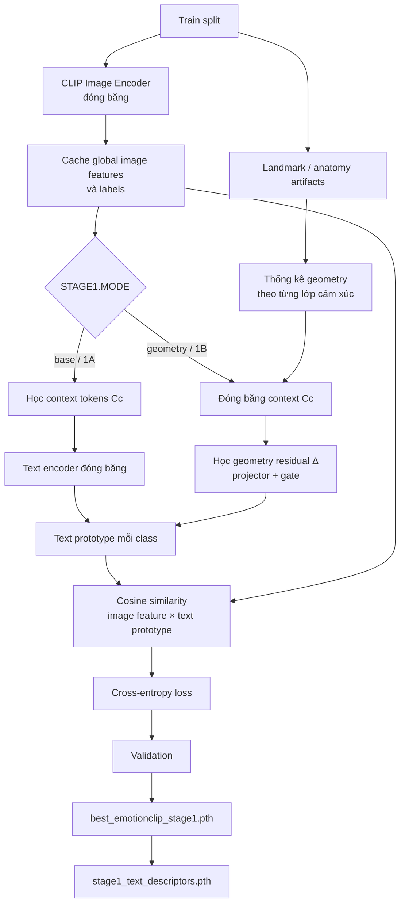

Khởi tạo prompt
      ↓
1A: mở khóa Cc, học context token
      ↓
Kết thúc 1A
      ↓
Đóng băng Cc
      ↓
1B: mở khóa geometry projector + gate
      ↓
Học residual Δ, nhưng không sửa Cc
      ↓
Kết thúc Stage 1: đóng băng toàn bộ prompt hiệu dụng

A photo of a face with
[V0]
[V1 + Δupper]
[V2 + Δmiddle]
[V3 + Δlower]
showing an angry expression.

STAGE 1
Class-level geometry
"hình học trung bình của lớp happy/sad/anger"
          │
          ▼
Điều chỉnh text prompt
          │
          ▼
Tạo semantic prototype tốt hơn

STAGE 2
Instance-level anatomy
"ảnh cụ thể này: mắt có đáng tin không,
miệng có bị che không, vùng nào nên route?"
          │
          ▼
Chọn/routing patch và vùng mặt
          │
          ▼
Fusion global + local + anatomy

Stage 1 geometry = geometry giúp prompt hiểu class
Stage 2 anatomy  = anatomy giúp model xử lý từng ảnh

