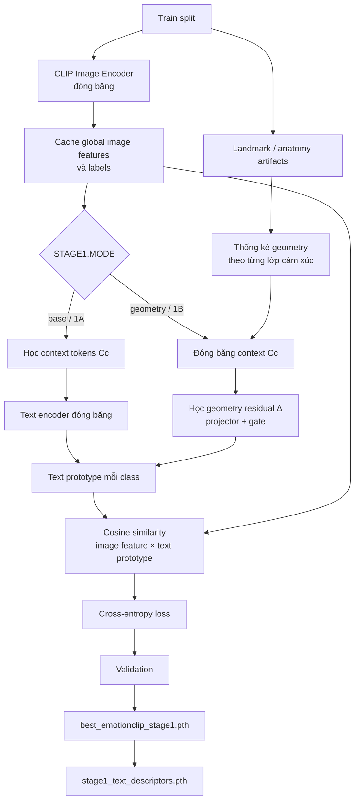

Khởi tạo prompt
      ↓
1A: mở khóa Cc, học context token
      ↓
Kết thúc 1A
      ↓
Đóng băng Cc
      ↓
1B: mở khóa geometry projector + gate
      ↓
Học residual Δ, nhưng không sửa Cc
      ↓
Kết thúc Stage 1: đóng băng toàn bộ prompt hiệu dụng

A photo of a face with
[V0]
[V1 + Δupper]
[V2 + Δmiddle]
[V3 + Δlower]
showing an angry expression.

STAGE 1
Class-level geometry
"hình học trung bình của lớp happy/sad/anger"
          │
          ▼
Điều chỉnh text prompt
          │
          ▼
Tạo semantic prototype tốt hơn

STAGE 2
Instance-level anatomy
"ảnh cụ thể này: mắt có đáng tin không,
miệng có bị che không, vùng nào nên route?"
          │
          ▼
Chọn/routing patch và vùng mặt
          │
          ▼
Fusion global + local + anatomy

Stage 1 geometry = geometry giúp prompt hiểu class
Stage 2 anatomy  = anatomy giúp model xử lý từng ảnh



Anatomy — 440,646 tham số
Nhóm này tạo local/anatomy branch. Nó gồm các thành phần như:
Chiếu patch feature thành key cho attention.
Các query học được tương ứng với vùng khuôn mặt.
Định tuyến 196 image patches đến mắt, mũi, miệng hoặc các vùng giải phẫu.
Mã hóa landmark và geometry feature.
Chuẩn hóa đặc trưng từng vùng.
Tính importance của từng vùng khi tạo local logits.

patch features
      ↓
learned region queries
      ↓
eyes / nose / mouth features
      ↓
local emotion logits

| Nhóm           | Số tham số        | Tỷ lệ        | Vai trò                                  |
| --------------- | ------------------- | -------------- | ----------------------------------------- |
| Adapters        | 1,189,632           | 69.9%          | Điều chỉnh biểu diễn ảnh CLIP       |
| Anatomy         | 440,646             | 25.9%          | Routing patch và đặc trưng vùng mặt |
| Reliability     | 67,857              | 4.0%           | Ước lượng độ tin cậy/uncertainty   |
| Classifier      | 3,591               | 0.21%          | Chuyển embedding thành 7 logits         |
| Temperature     | 3                   | ~0%            | Hiệu chỉnh scale của ba nhánh         |
| **Tổng** | **1,701,729** | **100%** |                                           |

Reliability head — 67,857 tham số
Nhóm này bị thiếu trong danh sách ban đầu. Input của reliability head gồm:
512 visual features

### Temperature — 3 scalar

Có một temperature cho mỗi nhánh:

```
T_classifier
T_global
T_local
```

Fusion sử dụng:

```
scaled_logits = branch_logits / temperature
```

Ý nghĩa:

* `T < 1`: phóng đại logits, tăng confidence và gradient.
* `T > 1`: làm phẳng logits, giảm confidence.
* `T = 1`: giữ nguyên.

Chỉ có 3 tham số nhưng ảnh hưởng rất lớn. Ví dụ:

```
T = 1.0  → scale 1×
T = 0.1  → scale 10×
T = 0.07 → scale 14.29×
```

Trong run hiện tại, ba temperature bắt đầu ở `1.0` và chỉ giảm đến khoảng `0.99`. Vì vậy chúng không bù được scale CLIP bị loại bỏ ở Stage 2.

### Tại sao phân bố này gây vấn đề?

Stage 2 đang dùng một LR chung cho mọi nhóm:

```
Adapters 1.19M ─┐
Anatomy 440K   ─┼─ AdamW(lr=5e-6) + global grad clipping
Classifier 3.6K─┤
Temperature 3  ─┘
```

Do đó:

* Hai nhóm representation lớn bắt đầu thay đổi ngay.
* Classifier mới chưa kịp học ổn định.
* Ba temperature hiệu chỉnh quá chậm.
* Routing loss đồng thời kéo adapters theo anatomy.
* Classifier bias dễ học phân bố lớp phổ biến.

+ region quality
+ min/mean quality
+ valid-region ratio
+ pose quality
+ crop quality
  = 520 chiều

### “Ảnh nhiễu/che vùng” là gì?

Code clone ảnh tham chiếu:

```
corrupted = images.detach().clone()
```

Sau đó áp dụng hai phép biến đổi nhân tạo.

1. Thêm Gaussian noise:

```
corrupted += randn_like(corrupted) * 0.08
```

2. Chọn ngẫu nhiên một hình chữ nhật kích thước khoảng:

```
20% chiều cao × 20% chiều rộng
```

rồi gán vùng đó bằng `0`.

Ví dụ:

```
Ảnh tham chiếu              Bản sao corrupted

┌──────────────┐            ┌──────────────┐
│  mắt    mắt  │            │  mắt  █████  │
│              │     →      │       █████  │
│     mũi      │            │     mũi      │
│    miệng     │            │    miệng     │
└──────────────┘            └──────────────┘
```

Lưu ý: thao tác diễn ra sau normalization, nên giá trị `0` không nhất thiết là màu đen trong RGB; nó gần với màu trung bình theo không gian ảnh đã chuẩn hóa.

### Mục đích của hai bản ảnh

Mô hình được chạy hai lần:

```
Reference image → reliability strength cao hơn
Corrupted copy  → reliability strength thấp hơn
```

Không có hai ảnh riêng trong dataset và ảnh gốc không bị ghi đè. Bản corrupted chỉ được tạo tạm thời trong RAM cho auxiliary loss.


## Thiết kế Stage 2 đề xuất

```
Stage 1 checkpoint
        ↓
Stage 2A: Head calibration
        ↓
Stage 2B: Anatomy bootstrap
        ↓
Stage 2C: Gradual adapter fine-tuning
        ↓
Stage 2D: Classifier re-balancing + calibration
```

### Stage 2A — Head calibration, 3–5 epoch

Train:

* Classifier.
* Fusion temperature.
* Có thể train fusion gate nếu đổi khỏi fixed.

Freeze:

* Toàn bộ adapters.
* Anatomy/router.
* Reliability head.
* `LAMBDA_ROUTING=0`.
* `LAMBDA_RANKING=0`.

Trong thời gian này dùng global-only hoặc gần global-only fusion:

```
classifier: 0 hoặc rất nhỏ
global:     1
local:      0 hoặc rất nhỏ
```

Mục tiêu là tìm classifier head tốt trước khi representation được phép thay đổi. Đây chính là ý tưởng LP-FT: train linear head trước rồi mới fine-tune feature extractor. Nghiên cứu chỉ ra rằng head ngẫu nhiên được học đồng thời với backbone có thể làm pretrained features bị biến dạng; LP-FT giảm hiện tượng này đáng kể. [Kumar et al., ICLR 2022 — Fine-Tuning can Distort Pretrained Features](https://arxiv.org/abs/2202.10054).

Việc này đặc biệt phù hợp với code hiện tại vì classifier được khởi tạo ngẫu nhiên tại [emotionclip_model.py (line 870)](/E:/Source/EmotionCLIP-ReID/model/emotionclip_model.py:870), nhưng adapters lại được mở đồng thời tại [emotionclip_model.py (line 922)](/E:/Source/EmotionCLIP-ReID/model/emotionclip_model.py:922).


### Stage 2B — Anatomy bootstrap, 3–5 epoch

Train:

* Anatomy router/local branch.
* Classifier.
* Temperature local/global.

Vẫn freeze adapters.

Routing schedule:

```
epoch đầu: λ_routing = 0
sau đó:    0 → 0.01 → 0.025 → 0.05
```

Vì adapters bị freeze, routing loss không thể làm thay đổi representation CLIP. Nó chỉ học router và anatomy module.

Nên thêm riêng:

```
local_ce = CE(local_logits, labels)
```

thay vì chỉ dựa vào:

```
alignment_logits = 0.5 * (global + local)
```

Hiện global branch có thể che giấu việc local branch chưa học tốt.

### Stage 2C — Gradual adapter fine-tuning

Sau khi classifier và anatomy đã ổn định:

1. Mở 4 adapters cuối.
2. Sau vài epoch mới mở toàn bộ adapters.
3. Adapter LR nhỏ hơn head từ 10–100 lần.
4. Routing loss ramp chậm, không bật ngay `0.05`.

Gradual unfreezing và discriminative learning rates được đề xuất trong ULMFiT để tránh catastrophic forgetting khi fine-tune pretrained model. Dù bài báo thuộc NLP, nguyên lý tối ưu hóa áp dụng trực tiếp cho trường hợp này. [Howard &amp; Ruder, ACL 2018 — ULMFiT](https://aclanthology.org/P18-1031/).

Có thể bổ sung regularization giữ adapters gần trạng thái khởi tạo:

```
L_sp = Σ ||θ_adapter - θ_adapter_initial||²
```

L2-SP cho thấy regularize về pretrained starting point giữ lại feature tốt hơn standard weight decay. [Li et al., ICML 2018 — Explicit Inductive Bias for Transfer Learning](https://proceedings.mlr.press/v80/li18a.html).

Một lựa chọn khác phù hợp hơn với CLIP là retention loss:

```
L_keep = KL(
    softmax(stage1_global_logits),
    softmax(stage2_global_logits)
)
```

Nhờ đó Stage 2 không được phép phá mạnh dự đoán global của Stage 1.

### Stage 2D — Classifier re-balancing

Cuối Stage 2:

* Freeze adapters và anatomy.
* Chỉ fine-tune classifier/fusion.
* Dùng class-balanced sampler hoặc balanced loss.
* Calibrate temperature trên validation split.

Cách tách representation và classifier đã được chứng minh hiệu quả trong long-tailed recognition: representation có thể học bằng phân phối tự nhiên, sau đó classifier được điều chỉnh riêng bằng dữ liệu cân bằng. [Kang et al., ICLR 2020 — Decoupling Representation and Classifier](https://iclr.cc/virtual/2020/poster/2000).

Đây là hướng rất phù hợp với RAF-DB vì tỷ lệ `happiness:fear` khoảng `17:1`.


```
2A: classifier warm-up
    adapters/anatomy freeze

2B: anatomy + classifier
    adapters freeze
    anatomy gate ramp dần
    ranking tắt hoặc mask chặt

2C: joint fine-tuning
    discriminative LR
    full canonical inference
    được phép cập nhật best_deploy

Sau đó: post-hoc temperature calibration
```
